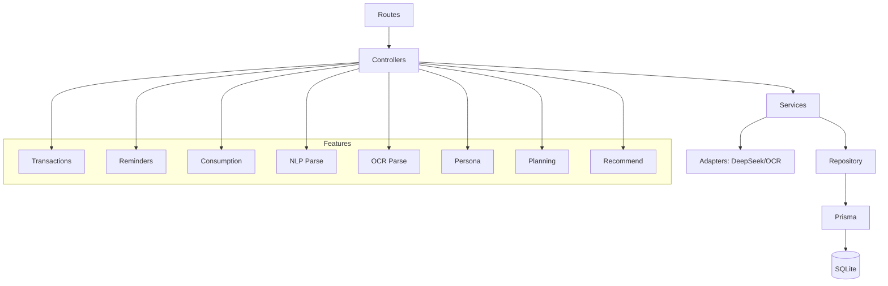

# 后端模块与分层

```mermaid
flowchart TB
  R[Routes]
  C[Controllers]
  S[Services]
  A[Adapters: DeepSeek/OCR]
  RP[Repository]
  PR[Prisma]
  DB[(SQLite)]

  R --> C --> S --> RP --> PR --> DB
  S --> A

  subgraph Features
    TX[Transactions]
    RM[Reminders]
    CS[Consumption]
    NL[NLP Parse]
    OC[OCR Parse]
    PE[Persona]
    PL[Planning]
    RE[Recommend]
  end

  C ---> TX
  C ---> RM
  C ---> CS
  C ---> NL
  C ---> OC
  C ---> PE
  C ---> PL
  C ---> RE
```

- 校验：zod；错误：统一 ErrorHandler；日志：pino/winston 任一
- 安全：helmet、CORS（dev）、速率限制；DeepSeek Key 用环境变量管理
