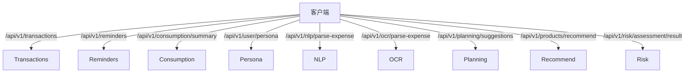

# 接口地图（版本 1）

> 统一响应：{ code, message, data }；金额单位：分；时间：ISO 字符串

- 交易模块
  - GET /transactions?page&size&from&to&category
  - POST /transactions
  - PATCH /transactions/:id
  - GET /transactions/anomaly-scan?since
- 提醒模块
  - GET /reminders
  - POST /reminders
  - POST /reminders/:id/status
  - POST /reminders/:id
- 消费分析模块
  - GET /consumption/summary?from&to
- 用户画像模块
  - GET /user/persona
- 智能入口模块
  - POST /nlp/parse-expense
  - POST /ocr/parse-expense (multipart)
- 规划与推荐模块
  - POST /planning/suggestions
  - POST /products/recommend
  - GET /risk/assessment/result?userId=...
