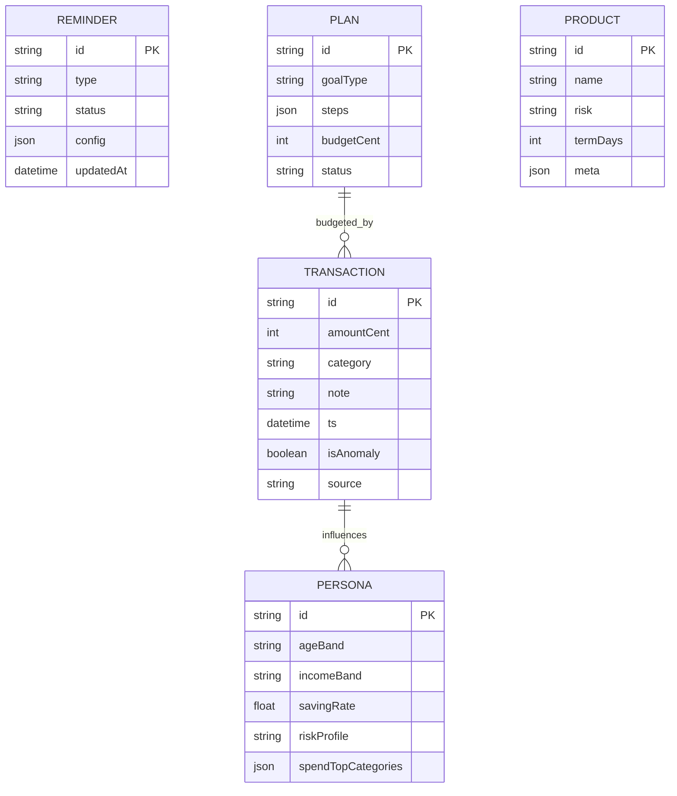

# 数据库实体关系图（ERD，简化）

```mermaid
erDiagram
  TRANSACTION {
    string id PK
    int amountCent
    string category
    string note
    datetime ts
    boolean isAnomaly
    string source
  }
  REMINDER {
    string id PK
    string type
    string status
    json config
    datetime updatedAt
  }
  PERSONA {
    string id PK
    string ageBand
    string incomeBand
    float savingRate
    string riskProfile
    json spendTopCategories
  }
  PLAN {
    string id PK
    string goalType
    json steps
    int budgetCent
    string status
  }
  PRODUCT {
    string id PK
    string name
    string risk
    int termDays
    json meta
  }

  TRANSACTION ||--o{ PERSONA : influences
  PLAN ||--o{ TRANSACTION : budgeted_by
```

说明：

- 关系为示意；SQLite 实际可用外键或以宽表/索引实现
- 后续可增加 USER/TAG 等表
