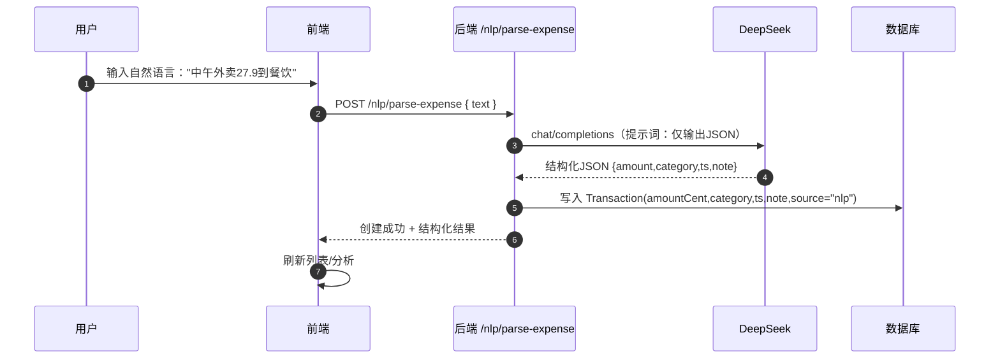
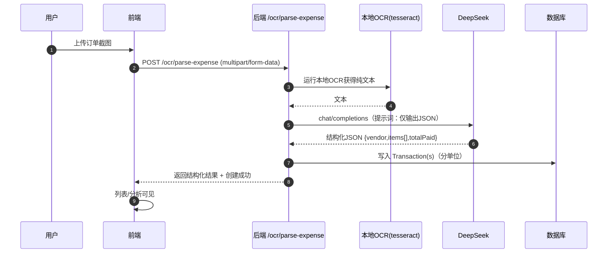

# 数据流：文字与图片记账

## 文本记账（NLP 结构化）

```mermaid
sequenceDiagram
  autonumber
  participant U as 用户
  participant UI as 前端
  participant API as 后端 /nlp/parse-expense
  participant DS as DeepSeek
  participant DB as 数据库

  U->>UI: 输入自然语言："中午外卖27.9到餐饮"
  UI->>API: POST /nlp/parse-expense { text }
  API->>DS: chat/completions（提示词：仅输出JSON）
  DS-->>API: 结构化JSON {amount,category,ts,note}
  API->>DB: 写入 Transaction(amountCent,category,ts,note,source="nlp")
  API-->>UI: 创建成功 + 结构化结果
  UI->>UI: 刷新列表/分析
```

## 图片记账（OCR → 结构化）

```mermaid
sequenceDiagram
  autonumber
  participant U as 用户
  participant UI as 前端
  participant OCR as 后端 /ocr/parse-expense
  participant T as 本地OCR(tesseract)
  participant DS as DeepSeek
  participant DB as 数据库

  U->>UI: 上传订单截图
  UI->>OCR: POST /ocr/parse-expense (multipart/form-data)
  OCR->>T: 运行本地OCR获得纯文本
  T-->>OCR: 文本
  OCR->>DS: chat/completions（提示词：仅输出JSON）
  DS-->>OCR: 结构化JSON {vendor,items[],totalPaid}
  OCR->>DB: 写入 Transaction(s)（分单位）
  OCR-->>UI: 返回结构化结果 + 创建成功
  UI->>UI: 列表/分析可见
```
