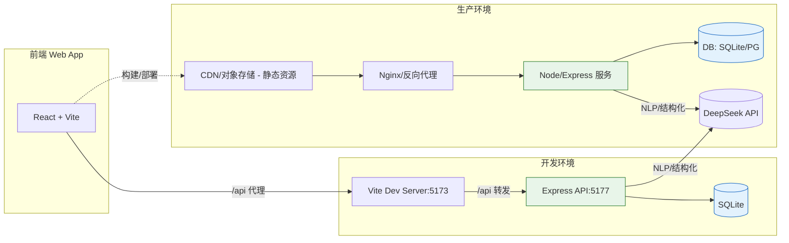

# 架构总览（系统级）

```mermaid
flowchart LR
  subgraph Client[前端 Web App]
    UI[React + Vite]
  end

  subgraph Dev[开发环境]
    Vite[Vite Dev Server:5173]
    BE[Express API:5177]
    DB[(SQLite)]
  end

  subgraph Cloud[生产环境]
    CDN[CDN/对象存储 - 静态资源]
    Nginx[Nginx/反向代理]
    SVC[Node/Express 服务]
    RDB[(DB: SQLite/PG)]
    DS[(DeepSeek API)]
  end

  UI -->|/api 代理| Vite
  Vite -->|/api 转发| BE
  BE --> DB
  BE -->|NLP/结构化| DS

  UI -. 构建/部署 .-> CDN
  CDN --> Nginx --> SVC --> RDB
  SVC -->|NLP/结构化| DS

  classDef svc fill:#e8f5e9,stroke:#2e7d32;
  classDef db fill:#e3f2fd,stroke:#1565c0;
  class BE,SVC svc
  class DB,RDB db
```

要点：

- 开发态：Vite 代理 /api → 本地后端（5177），避免 CORS；DeepSeek 仅由后端访问
- 生产态：静态资源走 CDN/对象存储；Nginx 反代 `/api` 到 Node 服务
- 模型/密钥：仅在服务端；前端永不暴露 Key
