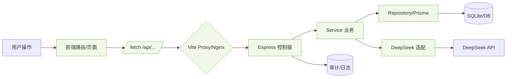

# 访问走向（用户与后台）

```mermaid
flowchart LR
  U[用户操作]-->H[前端路由/页面]
  H-->API[/fetch /api/.../]
  API-->GW{Vite Proxy/Nginx}
  GW-->SVC[Express 控制器]
  SVC-->SV[Service 业务]
  SV-->Repo[Repository/Prisma]
  Repo-->DB[(SQLite/DB)]
  SV-->AI[DeepSeek 适配]
  AI-->LLM[DeepSeek API]
  SVC-->AUDIT[(审计/日志)]

  classDef box fill:#f1f8e9,stroke:#7cb342;
  class H,API,GW,SVC,SV,Repo,AI box
```

要点：

- 前端统一走 `/api`，开发态 Vite 代理，生产态 Nginx 反代
- 控制器只做参数校验与编排，业务逻辑在 Service，数据访问在 Repository
- 模型访问统一通过适配层（隐藏 Key，便于替换供应商或加速）
