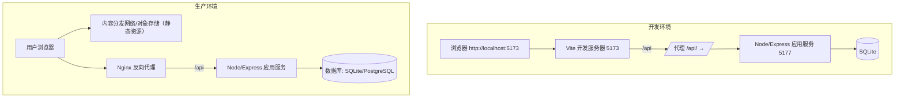

# 部署拓扑（开发环境 / 生产环境）

```mermaid
flowchart TB
  subgraph Dev[开发环境]
    A[浏览器 http://localhost:5173]
    V[Vite 开发服务器 5173]
    P[/代理 /api/ →/]
    B[Node/Express 应用服务 5177]
    D[(SQLite)]
    A --> V
    V -->|/api| P --> B --> D
  end

  subgraph Prod[生产环境]
    U[用户浏览器]
    CDN[内容分发网络/对象存储（静态资源）]
    NG[Nginx 反向代理]
    SVC[Node/Express 应用服务]
    R[(数据库: SQLite/PostgreSQL)]
    U --> CDN
    U --> NG
    NG -->|/api| SVC --> R
  end
```

注意：

- 生产环境可以由 Nginx 同时托管静态资源并反向代理 `/api`；也可以将静态资源交给 CDN，仅 `/api` 通过 Nginx 转发
- 数据库初期使用 SQLite（文件型，运维成本低），后续可以迁移到 PostgreSQL/MySQL，仅需调整 Prisma 数据源配置
