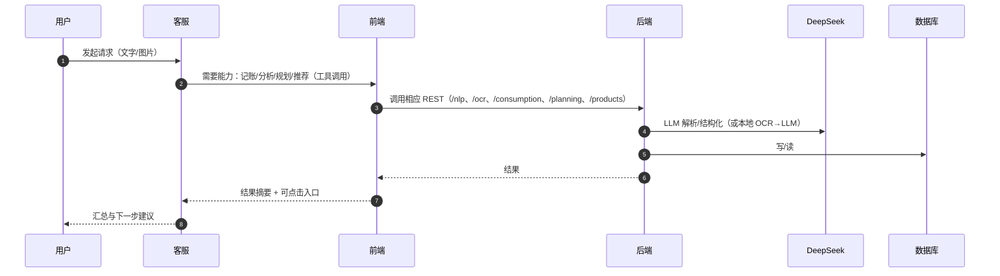

# 智能客服：编排与工具

[返回文档索引](索引.md) · [查看智能体提示词](ai/assistant_prompts.md) · [查看后端接口](backend-api.md)

## 对话到动作（时序）

## 工具契约（摘要）

- createTransaction({ amountCent, category, note, ts, extras })
- classifyExpense({ text | ocrJson | items[] }) => { category, subCategory, confidence }
- fetchConsumptionSummary({ from,to }) => { byCategory[], trend[], frequency[] }
- fetchUserPersona() => { ageBand, incomeBand, savingRate, spendTopCategories[], riskProfile }
- planSuggestions({ goalType, budget, duration }) => { options[] }
- productRecommend({ riskPreference, termDays, amount }) => { products[], riskTips[] }

说明：系统提示与模板详见 [docs/ai/assistant_prompts.md](ai/assistant_prompts.md)。
