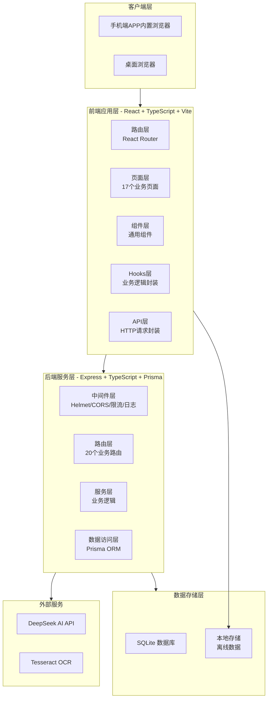
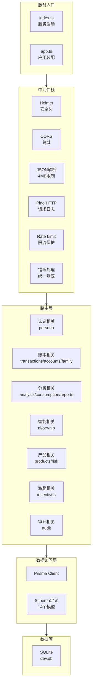
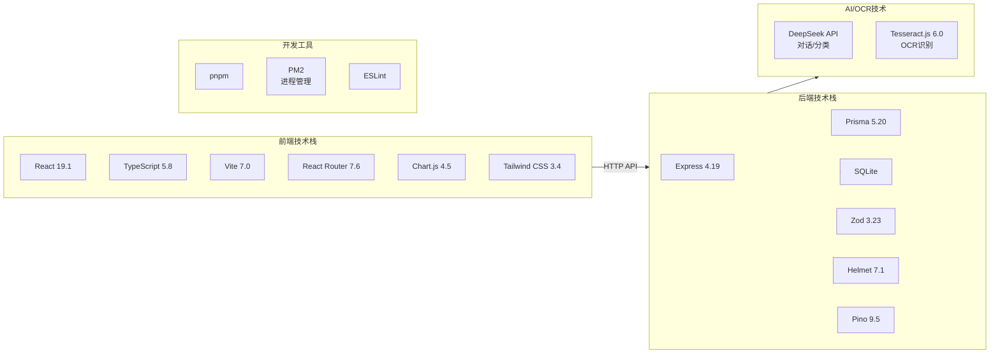

# 系统整体架构流程图

## 1. 系统架构总览

```mermaid
flowchart TB
    subgraph Client["客户端层"]
        Mobile["手机端APP内置浏览器"]
        Desktop["桌面浏览器"]
    end

    subgraph Frontend["前端应用层 - React + TypeScript + Vite"]
        Router["路由层<br/>React Router"]
        Pages["页面层<br/>17个业务页面"]
        Components["组件层<br/>通用组件"]
        Hooks["Hooks层<br/>业务逻辑封装"]
        API["API层<br/>HTTP请求封装"]
    end

    subgraph Backend["后端服务层 - Express + TypeScript + Prisma"]
        Middleware["中间件层<br/>Helmet/CORS/限流/日志"]
        Routes["路由层<br/>20个业务路由"]
        Services["服务层<br/>业务逻辑"]
        DB["数据访问层<br/>Prisma ORM"]
    end

    subgraph External["外部服务"]
        DeepSeek["DeepSeek AI API"]
        Tesseract["Tesseract OCR"]
    end

    subgraph Database["数据存储层"]
        SQLite["SQLite 数据库"]
        LocalStorage["本地存储<br/>离线数据"]
    end

    Client --> Frontend
    Frontend --> Backend
    Backend --> External
    Backend --> Database
    Frontend --> LocalStorage
```

## 2. 前端架构分层

```mermaid
flowchart LR
    subgraph Entry["入口层"]
        Main["main.tsx<br/>应用入口"]
        App["App.tsx<br/>根组件"]
    end

    subgraph RouterLayer["路由层"]
        BrowserRouter["BrowserRouter"]
        Routes["路由配置<br/>17个页面路由"]
        MainLayout["MainLayout<br/>布局容器"]
    end

    subgraph PageLayer["页面层"]
        Auth["认证页面<br/>登录/注册"]
        Home["首页"]
        Accounting["记账页面"]
        Analysis["分析页面"]
        Planning["规划页面"]
        Products["产品页面"]
        Family["家庭页面"]
        Service["客服页面"]
        Settings["设置页面"]
    end

    subgraph ComponentLayer["组件层"]
        AssistantPanel["助手面板"]
        MobileTabBar["移动端Tab栏"]
        TopBarActions["顶部操作栏"]
        ErrorBoundary["错误边界"]
        DynamicAlert["动态提醒"]
    end

    subgraph HooksLayer["Hooks层"]
        useAssistant["useAssistant<br/>AI对话"]
        useUserProgress["useUserAndProgress<br/>用户进度"]
        useAuditReminder["useAuditReminder<br/>审计提醒"]
    end

    subgraph APILayer["API层"]
        Endpoints["endpoints.ts<br/>接口定义"]
        HTTP["http.ts<br/>请求封装"]
        Types["types.ts<br/>类型定义"]
    end

    Entry --> RouterLayer
    RouterLayer --> PageLayer
    PageLayer --> ComponentLayer
    PageLayer --> HooksLayer
    HooksLayer --> APILayer
```

## 3. 后端架构分层

```mermaid
flowchart TB
    subgraph ServerEntry["服务入口"]
        Index["index.ts<br/>服务启动"]
        App["app.ts<br/>应用装配"]
    end

    subgraph MiddlewareStack["中间件栈"]
        Helmet["Helmet<br/>安全头"]
        CORS["CORS<br/>跨域"]
        JSON["JSON解析<br/>4MB限制"]
        Logger["Pino HTTP<br/>请求日志"]
        RateLimit["Rate Limit<br/>限流保护"]
        Error["错误处理<br/>统一响应"]
    end

    subgraph RouteLayer["路由层"]
        Auth_Routes["认证相关<br/>persona"]
        Ledger_Routes["账本相关<br/>transactions/accounts/family"]
        Analysis_Routes["分析相关<br/>analysis/consumption/reports"]
        AI_Routes["智能相关<br/>ai/ocr/nlp"]
        Product_Routes["产品相关<br/>products/risk"]
        Incentive_Routes["激励相关<br/>incentives"]
        Audit_Routes["审计相关<br/>audit"]
    end

    subgraph DataAccess["数据访问层"]
        Prisma["Prisma Client"]
        Schema["Schema定义<br/>14个模型"]
    end

    subgraph Database["数据库"]
        SQLite_DB["SQLite<br/>dev.db"]
    end

    ServerEntry --> MiddlewareStack
    MiddlewareStack --> RouteLayer
    RouteLayer --> DataAccess
    DataAccess --> Database
```

## 4. 技术栈关系图

```mermaid
flowchart LR
    subgraph FrontendTech["前端技术栈"]
        React["React 19.1"]
        TS["TypeScript 5.8"]
        Vite["Vite 7.0"]
        Router_Lib["React Router 7.6"]
        Chart["Chart.js 4.5"]
        Tailwind["Tailwind CSS 3.4"]
    end

    subgraph BackendTech["后端技术栈"]
        Express["Express 4.19"]
        Prisma_Lib["Prisma 5.20"]
        SQLite_DB["SQLite"]
        Zod["Zod 3.23"]
        Helmet_Lib["Helmet 7.1"]
        Pino["Pino 9.5"]
    end

    subgraph AITech["AI/OCR技术"]
        DeepSeek_API["DeepSeek API<br/>对话/分类"]
        Tesseract_JS["Tesseract.js 6.0<br/>OCR识别"]
    end

    subgraph DevTools["开发工具"]
        PNPM["pnpm"]
        PM2["PM2<br/>进程管理"]
        ESLint["ESLint"]
    end

    FrontendTech --> |HTTP API| BackendTech
    BackendTech --> AITech
    BackendTech --> SQLite_DB
```
