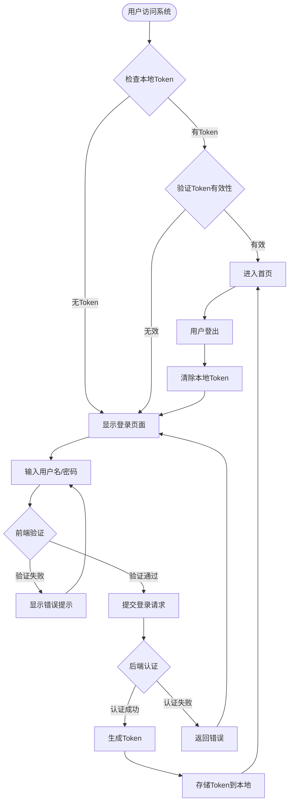
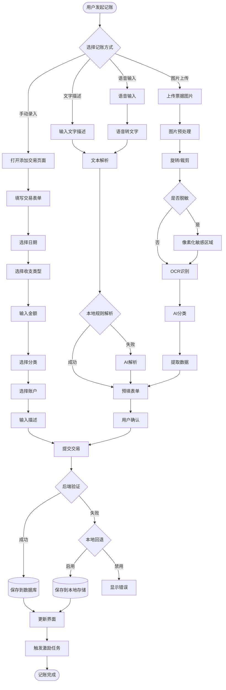
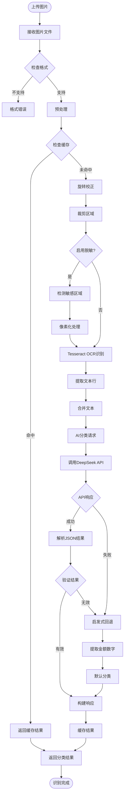
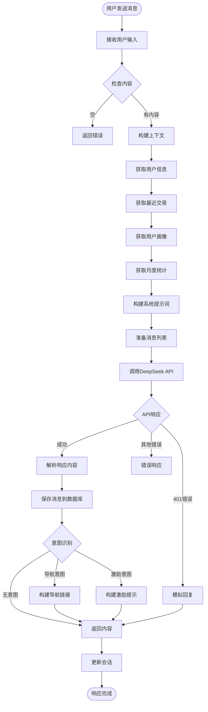
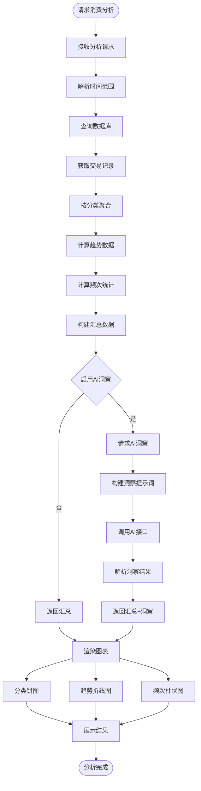
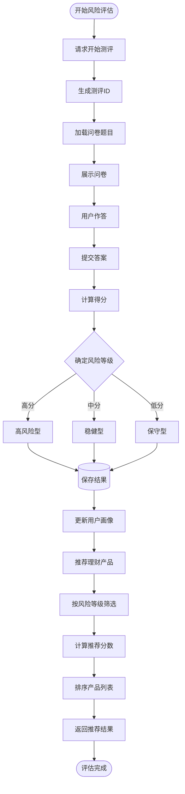

# 核心业务流程图

## 1. 用户认证流程

```mermaid
flowchart TD
    Start([用户访问系统]) --> CheckToken{检查本地Token}
    CheckToken --> |有Token| ValidateToken{验证Token有效性}
    CheckToken --> |无Token| LoginPage[显示登录页面]
    
    ValidateToken --> |有效| HomePage[进入首页]
    ValidateToken --> |无效| LoginPage
    
    LoginPage --> InputCredentials[输入用户名/密码]
    InputCredentials --> ValidateInput{前端验证}
    ValidateInput --> |验证失败| ShowError[显示错误提示]
    ShowError --> InputCredentials
    
    ValidateInput --> |验证通过| SubmitLogin[提交登录请求]
    SubmitLogin --> BackendAuth{后端认证}
    
    BackendAuth --> |认证成功| GenerateToken[生成Token]
    BackendAuth --> |认证失败| AuthError[返回错误]
    AuthError --> LoginPage
    
    GenerateToken --> StoreToken[存储Token到本地]
    StoreToken --> HomePage
    
    HomePage --> Logout[用户登出]
    Logout --> ClearToken[清除本地Token]
    ClearToken --> LoginPage
```

## 2. 记账主链路流程

```mermaid
flowchart TD
    Start([用户发起记账]) --> EntryType{选择记账方式}
    
    EntryType --> |手动录入| ManualEntry[打开添加交易页面]
    EntryType --> |文字描述| TextInput[输入文字描述]
    EntryType --> |图片上传| ImageUpload[上传票据图片]
    EntryType --> |语音输入| VoiceInput[语音输入]
    
    ManualEntry --> FillForm[填写交易表单]
    FillForm --> SelectDate[选择日期]
    SelectDate --> SelectType[选择收支类型]
    SelectType --> InputAmount[输入金额]
    InputAmount --> SelectCategory[选择分类]
    SelectCategory --> SelectAccount[选择账户]
    SelectAccount --> InputDesc[输入描述]
    InputDesc --> SubmitTransaction[提交交易]
    
    TextInput --> ParseText[文本解析]
    ParseText --> LocalParse{本地规则解析}
    LocalParse --> |成功| PrefillForm[预填表单]
    LocalParse --> |失败| AIParse[AI解析]
    AIParse --> PrefillForm
    PrefillForm --> ConfirmData[用户确认]
    ConfirmData --> SubmitTransaction
    
    ImageUpload --> PreprocessImage[图片预处理]
    PreprocessImage --> RotateCrop[旋转/裁剪]
    RotateCrop --> Desensitize{是否脱敏}
    Desensitize --> |是| Pixelate[像素化敏感区域]
    Desensitize --> |否| OCRProcess[OCR识别]
    Pixelate --> OCRProcess
    OCRProcess --> AIClassify[AI分类]
    AIClassify --> ExtractData[提取数据]
    ExtractData --> PrefillForm
    
    VoiceInput --> SpeechToText[语音转文字]
    SpeechToText --> ParseText
    
    SubmitTransaction --> ValidateBackend{后端验证}
    ValidateBackend --> |成功| SaveDB[(保存到数据库)]
    ValidateBackend --> |失败| LocalFallback{本地回退}
    
    LocalFallback --> |启用| SaveLocal[(保存到本地存储)]
    LocalFallback --> |禁用| ShowError2[显示错误]
    
    SaveDB --> UpdateUI[更新界面]
    SaveLocal --> UpdateUI
    UpdateUI --> TriggerGamification[触发激励任务]
    TriggerGamification --> End([记账完成])
```

## 3. OCR识别与分类流程

```mermaid
flowchart TD
    Start([上传图片]) --> ReceiveImage[接收图片文件]
    ReceiveImage --> CheckFormat{检查格式}
    CheckFormat --> |不支持| ErrorFormat[格式错误]
    CheckFormat --> |支持| Preprocess[预处理]
    
    Preprocess --> CheckCache{检查缓存}
    CheckCache --> |命中| ReturnCache[返回缓存结果]
    CheckCache --> |未命中| Rotate[旋转校正]
    
    Rotate --> Crop[裁剪区域]
    Crop --> DesensitizeCheck{启用脱敏?}
    DesensitizeCheck --> |是| DetectSensitive[检测敏感区域]
    DesensitizeCheck --> |否| OCRRecognize
    DetectSensitive --> PixelateRegion[像素化处理]
    PixelateRegion --> OCRRecognize[Tesseract OCR识别]
    
    OCRRecognize --> ExtractText[提取文本行]
    ExtractText --> ConcatLines[合并文本]
    ConcatLines --> AIClassification[AI分类请求]
    
    AIClassification --> CallDeepSeek[调用DeepSeek API]
    CallDeepSeek --> APICheck{API响应}
    APICheck --> |成功| ParseJSON[解析JSON结果]
    APICheck --> |失败| HeuristicFallback[启发式回退]
    
    ParseJSON --> ValidateResult{验证结果}
    ValidateResult --> |有效| BuildResponse[构建响应]
    ValidateResult --> |无效| HeuristicFallback
    
    HeuristicFallback --> ExtractAmount[提取金额数字]
    ExtractAmount --> DefaultCategory[默认分类]
    DefaultCategory --> BuildResponse
    
    BuildResponse --> CacheResult[缓存结果]
    CacheResult --> ReturnResponse[返回分类结果]
    ReturnCache --> ReturnResponse
    ReturnResponse --> End([识别完成])
```

## 4. AI对话处理流程

```mermaid
flowchart TD
    Start([用户发送消息]) --> ReceiveMessage[接收用户输入]
    ReceiveMessage --> CheckContent{检查内容}
    CheckContent --> |空| ReturnError[返回错误]
    CheckContent --> |有内容| BuildContext[构建上下文]
    
    BuildContext --> GetUserInfo[获取用户信息]
    GetUserInfo --> GetTransactions[获取最近交易]
    GetTransactions --> GetPersona[获取用户画像]
    GetPersona --> GetMonthlyStats[获取月度统计]
    
    GetMonthlyStats --> BuildSystemPrompt[构建系统提示词]
    BuildSystemPrompt --> PrepareMessages[准备消息列表]
    
    PrepareMessages --> CallDeepSeek[调用DeepSeek API]
    CallDeepSeek --> APICheck{API响应}
    
    APICheck --> |成功| ParseResponse[解析响应内容]
    APICheck --> |401错误| MockResponse[模拟回复]
    APICheck --> |其他错误| ErrorResponse[错误响应]
    
    ParseResponse --> SaveMessage[保存消息到数据库]
    SaveMessage --> IntentRecognition{意图识别}
    
    IntentRecognition --> |导航意图| BuildNavCTA[构建导航链接]
    IntentRecognition --> |激励意图| BuildIncentiveCTA[构建激励提示]
    IntentRecognition --> |无意图| ReturnContent[返回内容]
    
    BuildNavCTA --> ReturnContent
    BuildIncentiveCTA --> ReturnContent
    MockResponse --> ReturnContent
    
    ReturnContent --> UpdateSession[更新会话]
    UpdateSession --> End([响应完成])
```

## 5. 消费分析流程

```mermaid
flowchart TD
    Start([请求消费分析]) --> ReceiveRequest[接收分析请求]
    ReceiveRequest --> ParseParams[解析时间范围]
    ParseParams --> QueryDB[查询数据库]
    
    QueryDB --> GetTransactions[获取交易记录]
    GetTransactions --> AggregateByCategory[按分类聚合]
    AggregateByCategory --> CalculateTrend[计算趋势数据]
    CalculateTrend --> CalculateFrequency[计算频次统计]
    
    CalculateFrequency --> BuildSummary[构建汇总数据]
    BuildSummary --> CheckAIInsights{启用AI洞察}
    
    CheckAIInsights --> |是| RequestAIInsights[请求AI洞察]
    CheckAIInsights --> |否| ReturnSummary[返回汇总]
    
    RequestAIInsights --> BuildInsightPrompt[构建洞察提示词]
    BuildInsightPrompt --> CallAI[调用AI接口]
    CallAI --> ParseInsights[解析洞察结果]
    ParseInsights --> ReturnWithInsights[返回汇总+洞察]
    
    ReturnSummary --> RenderCharts[渲染图表]
    ReturnWithInsights --> RenderCharts
    
    RenderCharts --> CategoryPie[分类饼图]
    RenderCharts --> TrendLine[趋势折线图]
    RenderCharts --> FrequencyBar[频次柱状图]
    
    CategoryPie --> DisplayResult[展示结果]
    TrendLine --> DisplayResult
    FrequencyBar --> DisplayResult
    
    DisplayResult --> End([分析完成])
```

## 6. 风险评估流程

```mermaid
flowchart TD
    Start([开始风险评估]) --> RequestStart[请求开始测评]
    RequestStart --> GenerateAssessment[生成测评ID]
    GenerateAssessment --> LoadQuestions[加载问卷题目]
    
    LoadQuestions --> DisplayQuestions[展示问卷]
    DisplayQuestions --> UserAnswer[用户作答]
    UserAnswer --> SubmitAnswer[提交答案]
    
    SubmitAnswer --> CalculateScore[计算得分]
    CalculateScore --> DetermineLevel{确定风险等级}
    
    DetermineLevel --> |高分| HighRisk[高风险型]
    DetermineLevel --> |中分| MidRisk[稳健型]
    DetermineLevel --> |低分| LowRisk[保守型]
    
    HighRisk --> SaveResult[(保存结果)]
    MidRisk --> SaveResult
    LowRisk --> SaveResult
    
    SaveResult --> UpdatePersona[更新用户画像]
    UpdatePersona --> RecommendProducts[推荐理财产品]
    
    RecommendProducts --> FilterByRisk[按风险等级筛选]
    FilterByRisk --> CalculateScore2[计算推荐分数]
    CalculateScore2 --> SortProducts[排序产品列表]
    SortProducts --> ReturnRecommendations[返回推荐结果]
    
    ReturnRecommendations --> End([评估完成])
```
