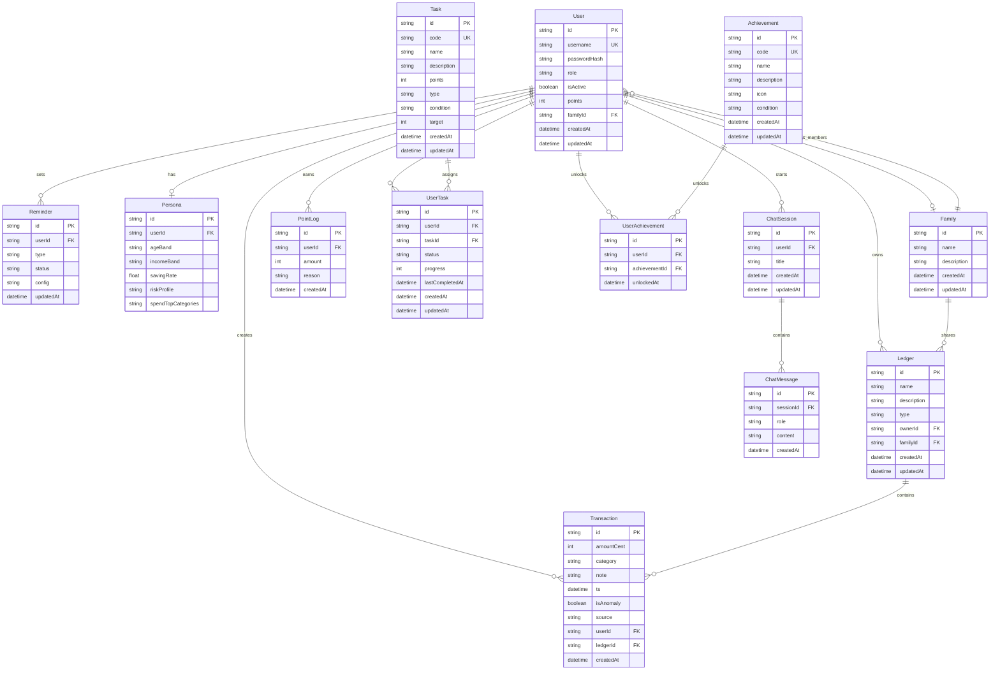
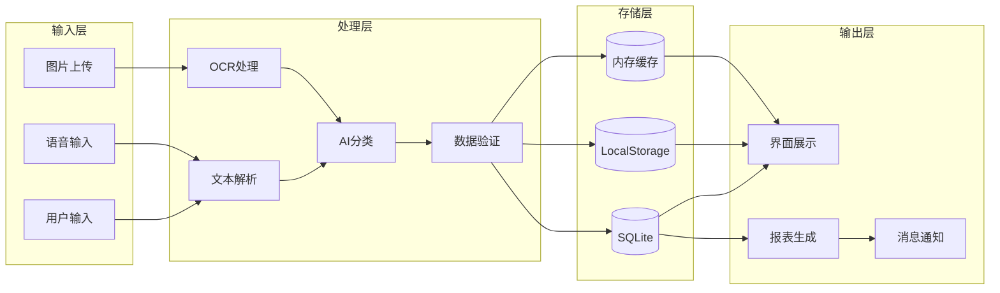
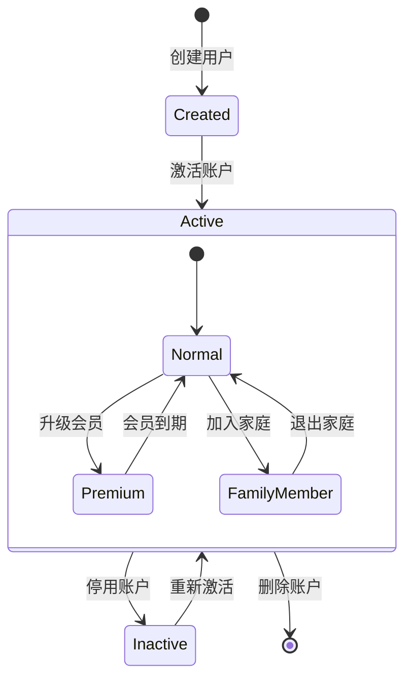
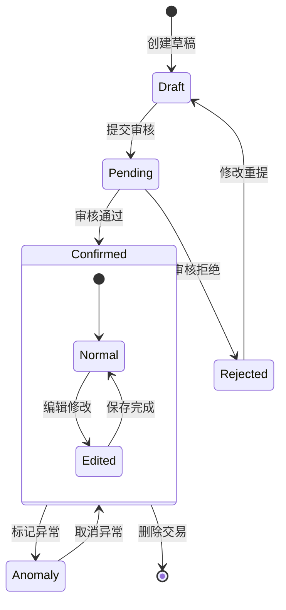
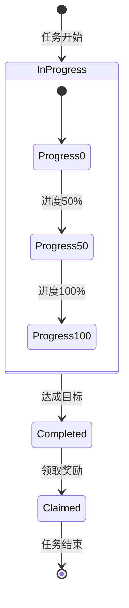
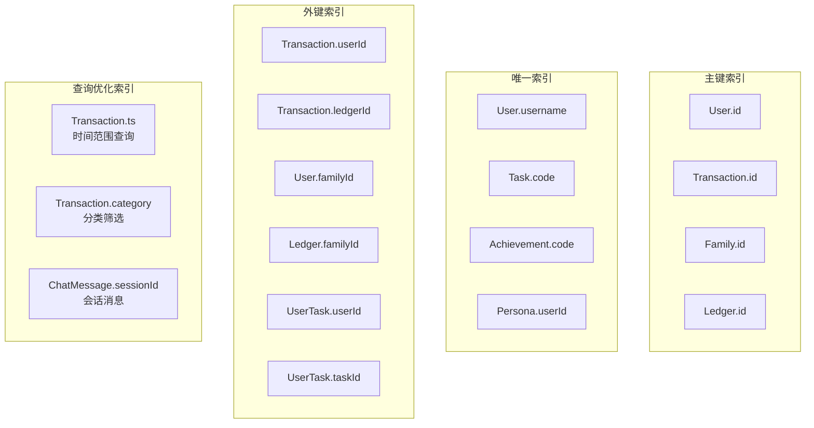

# 数据模型与数据库架构

## 1. 数据库实体关系图

```mermaid
erDiagram
    User ||--o{ Transaction : creates
    User ||--o{ Ledger : owns
    User ||--o{ Reminder : sets
    User ||--o| Persona : has
    User ||--o{ ChatSession : starts
    User ||--o{ PointLog : earns
    User ||--o{ UserTask : completes
    User ||--o{ UserAchievement : unlocks
    User }o--o| Family : belongs_to
    
    Family ||--o{ Ledger : shares
    Family ||--o{ User : has_members
    
    Ledger ||--o{ Transaction : contains
    
    ChatSession ||--o{ ChatMessage : contains
    
    Task ||--o{ UserTask : assigns
    Achievement ||--o{ UserAchievement : unlocks

    User {
        string id PK
        string username UK
        string passwordHash
        string role
        boolean isActive
        int points
        string familyId FK
        datetime createdAt
        datetime updatedAt
    }

    Family {
        string id PK
        string name
        string description
        datetime createdAt
        datetime updatedAt
    }

    Ledger {
        string id PK
        string name
        string description
        string type
        string ownerId FK
        string familyId FK
        datetime createdAt
        datetime updatedAt
    }

    Transaction {
        string id PK
        int amountCent
        string category
        string note
        datetime ts
        boolean isAnomaly
        string source
        string userId FK
        string ledgerId FK
        datetime createdAt
    }

    Persona {
        string id PK
        string userId FK
        string ageBand
        string incomeBand
        float savingRate
        string riskProfile
        string spendTopCategories
    }

    Reminder {
        string id PK
        string userId FK
        string type
        string status
        string config
        datetime updatedAt
    }

    ChatSession {
        string id PK
        string userId FK
        string title
        datetime createdAt
        datetime updatedAt
    }

    ChatMessage {
        string id PK
        string sessionId FK
        string role
        string content
        datetime createdAt
    }

    PointLog {
        string id PK
        string userId FK
        int amount
        string reason
        datetime createdAt
    }

    Task {
        string id PK
        string code UK
        string name
        string description
        int points
        string type
        string condition
        int target
        datetime createdAt
        datetime updatedAt
    }

    UserTask {
        string id PK
        string userId FK
        string taskId FK
        string status
        int progress
        datetime lastCompletedAt
        datetime createdAt
        datetime updatedAt
    }

    Achievement {
        string id PK
        string code UK
        string name
        string description
        string icon
        string condition
        datetime createdAt
        datetime updatedAt
    }

    UserAchievement {
        string id PK
        string userId FK
        string achievementId FK
        datetime unlockedAt
    }
```

## 2. 数据流向图

```mermaid
flowchart LR
    subgraph Input["输入层"]
        UserInput[用户输入]
        ImageUpload[图片上传]
        VoiceInput[语音输入]
    end

    subgraph Processing["处理层"]
        TextParse[文本解析]
        OCRProcess[OCR处理]
        AIClassify[AI分类]
        Validation[数据验证]
    end

    subgraph Storage["存储层"]
        SQLite[(SQLite)]
        LocalStorage[(LocalStorage)]
        Cache[(内存缓存)]
    end

    subgraph Output["输出层"]
        UI[界面展示]
        Report[报表生成]
        Notification[消息通知]
    end

    UserInput --> TextParse
    ImageUpload --> OCRProcess
    VoiceInput --> TextParse
    
    TextParse --> AIClassify
    OCRProcess --> AIClassify
    AIClassify --> Validation
    
    Validation --> SQLite
    Validation --> LocalStorage
    Validation --> Cache
    
    SQLite --> UI
    SQLite --> Report
    LocalStorage --> UI
    Cache --> UI
    
    Report --> Notification
```

## 3. 核心实体生命周期

```mermaid
stateDiagram-v2
    [*] --> Created: 创建用户
    Created --> Active: 激活账户
    Active --> Inactive: 停用账户
    Inactive --> Active: 重新激活
    Active --> [*]: 删除账户

    state Active {
        [*] --> Normal
        Normal --> Premium: 升级会员
        Premium --> Normal: 会员到期
        Normal --> FamilyMember: 加入家庭
        FamilyMember --> Normal: 退出家庭
    }
```

## 4. 交易数据状态流转

```mermaid
stateDiagram-v2
    [*] --> Draft: 创建草稿
    Draft --> Pending: 提交审核
    Pending --> Confirmed: 审核通过
    Pending --> Rejected: 审核拒绝
    Rejected --> Draft: 修改重提
    Confirmed --> Anomaly: 标记异常
    Anomaly --> Confirmed: 取消异常
    Confirmed --> [*]: 删除交易

    state Confirmed {
        [*] --> Normal
        Normal --> Edited: 编辑修改
        Edited --> Normal: 保存完成
    }
```

## 5. 激励任务状态流转

```mermaid
stateDiagram-v2
    [*] --> InProgress: 任务开始
    InProgress --> Completed: 达成目标
    Completed --> Claimed: 领取奖励
    Claimed --> [*]: 任务结束

    state InProgress {
        [*] --> Progress0
        Progress0 --> Progress50: 进度50%
        Progress50 --> Progress100: 进度100%
    }
```

## 6. 数据库索引策略

```mermaid
flowchart TB
    subgraph PrimaryKeys["主键索引"]
        User_PK["User.id"]
        Transaction_PK["Transaction.id"]
        Family_PK["Family.id"]
        Ledger_PK["Ledger.id"]
    end

    subgraph UniqueKeys["唯一索引"]
        User_UK["User.username"]
        Task_UK["Task.code"]
        Achievement_UK["Achievement.code"]
        Persona_UK["Persona.userId"]
    end

    subgraph ForeignKeys["外键索引"]
        Transaction_User["Transaction.userId"]
        Transaction_Ledger["Transaction.ledgerId"]
        User_Family["User.familyId"]
        Ledger_Family["Ledger.familyId"]
        UserTask_User["UserTask.userId"]
        UserTask_Task["UserTask.taskId"]
    end

    subgraph QueryOptimized["查询优化索引"]
        Transaction_TS["Transaction.ts<br/>时间范围查询"]
        Transaction_Category["Transaction.category<br/>分类筛选"]
        ChatMessage_Session["ChatMessage.sessionId<br/>会话消息"]
    end
```
