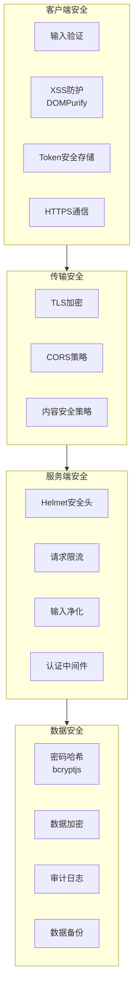
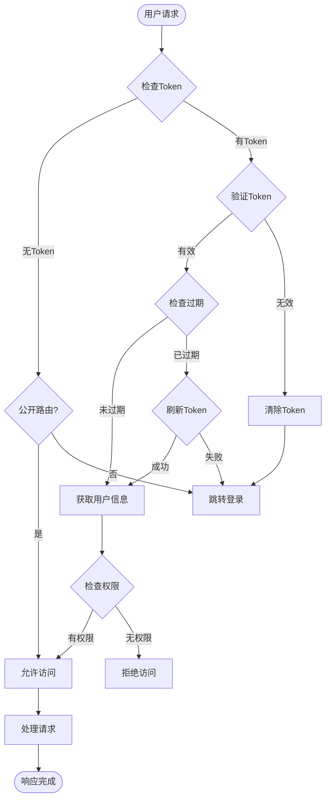
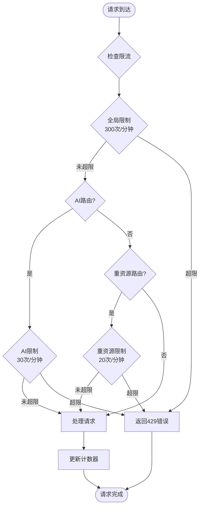
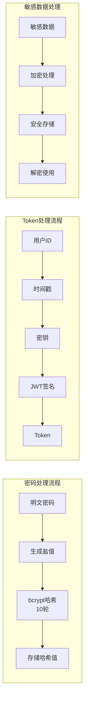
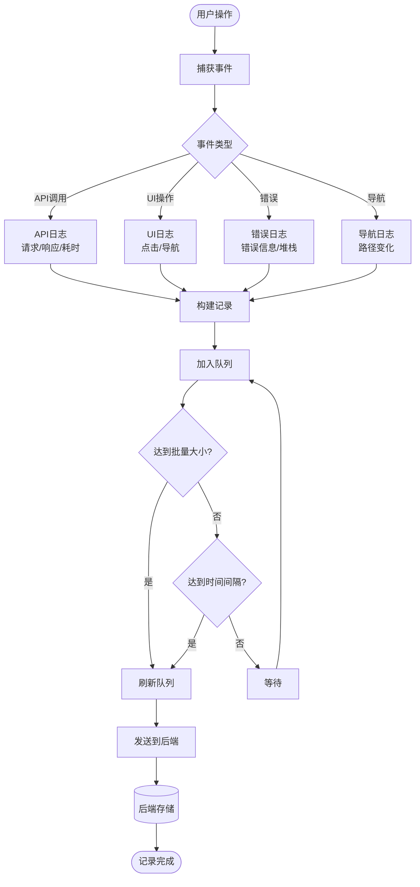
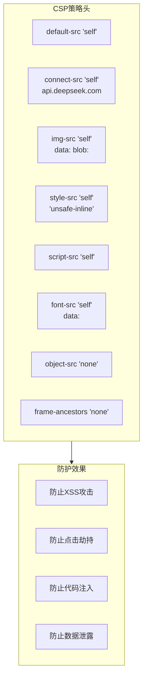
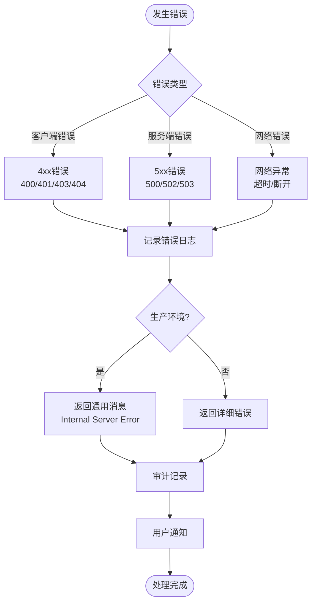
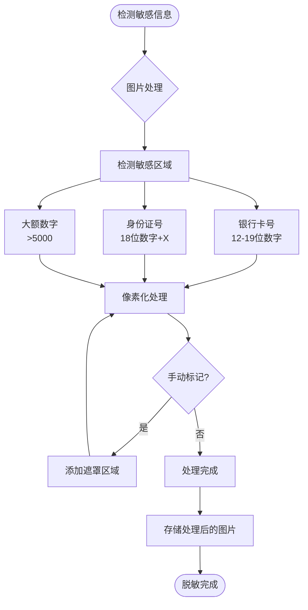

# 安全防护体系流程图

## 1. 安全架构总览

```mermaid
flowchart TB
    subgraph ClientSecurity["客户端安全"]
        InputValidation["输入验证"]
        XSSProtection["XSS防护<br/>DOMPurify"]
        TokenStorage["Token安全存储"]
        HTTPS["HTTPS通信"]
    end

    subgraph TransportSecurity["传输安全"]
        TLS["TLS加密"]
        CORS["CORS策略"]
        CSP["内容安全策略"]
    end

    subgraph ServerSecurity["服务端安全"]
        Helmet["Helmet安全头"]
        RateLimit["请求限流"]
        InputSanitization["输入净化"]
        AuthMiddleware["认证中间件"]
    end

    subgraph DataSecurity["数据安全"]
        PasswordHash["密码哈希<br/>bcryptjs"]
        DataEncryption["数据加密"]
        AuditLog["审计日志"]
        Backup["数据备份"]
    end

    ClientSecurity --> TransportSecurity
    TransportSecurity --> ServerSecurity
    ServerSecurity --> DataSecurity
```

## 2. 认证授权流程

```mermaid
flowchart TD
    Start([用户请求]) --> CheckToken{检查Token}
    CheckToken --> |无Token| PublicRoute{公开路由?}
    CheckToken --> |有Token| ValidateToken{验证Token}
    
    PublicRoute --> |是| AllowAccess[允许访问]
    PublicRoute --> |否| RedirectToLogin[跳转登录]
    
    ValidateToken --> |有效| CheckExpiry{检查过期}
    ValidateToken --> |无效| ClearToken[清除Token]
    
    CheckExpiry --> |未过期| GetUser[获取用户信息]
    CheckExpiry --> |已过期| RefreshToken{刷新Token}
    
    RefreshToken --> |成功| GetUser
    RefreshToken --> |失败| RedirectToLogin
    
    GetUser --> CheckPermission{检查权限}
    CheckPermission --> |有权限| AllowAccess
    CheckPermission --> |无权限| DenyAccess[拒绝访问]
    
    ClearToken --> RedirectToLogin
    AllowAccess --> ProcessRequest[处理请求]
    ProcessRequest --> End([响应完成])
```

## 3. 请求限流策略

```mermaid
flowchart TD
    Start([请求到达]) --> CheckRate{检查限流}
    
    CheckRate --> GlobalLimit{全局限制<br/>300次/分钟}
    GlobalLimit --> |未超限| AIRoute{AI路由?}
    GlobalLimit --> |超限| Return429[返回429错误]
    
    AIRoute --> |是| AILimit{AI限制<br/>30次/分钟}
    AIRoute --> |否| HeavyRoute{重资源路由?}
    
    AILimit --> |未超限| ProcessRequest[处理请求]
    AILimit --> |超限| Return429
    
    HeavyRoute --> |是| HeavyLimit{重资源限制<br/>20次/分钟}
    HeavyRoute --> |否| ProcessRequest
    
    HeavyLimit --> |未超限| ProcessRequest
    HeavyLimit --> |超限| Return429
    
    ProcessRequest --> UpdateCounter[更新计数器]
    UpdateCounter --> End([请求完成])
    Return429 --> End
```

## 4. 数据加密流程

```mermaid
flowchart LR
    subgraph PasswordFlow["密码处理流程"]
        PlainPassword["明文密码"]
        Salt["生成盐值"]
        Hash["bcrypt哈希<br/>10轮"]
        StoreHash["存储哈希值"]
    end

    subgraph TokenFlow["Token处理流程"]
        UserId["用户ID"]
        Timestamp["时间戳"]
        Secret["密钥"]
        Sign["JWT签名"]
        Token["Token"]
    end

    subgraph DataFlow["敏感数据处理"]
        SensitiveData["敏感数据"]
        Encrypt["加密处理"]
        Store["安全存储"]
        Decrypt["解密使用"]
    end

    PlainPassword --> Salt --> Hash --> StoreHash
    UserId --> Timestamp --> Secret --> Sign --> Token
    SensitiveData --> Encrypt --> Store --> Decrypt
```

## 5. 审计日志流程

```mermaid
flowchart TD
    Start([用户操作]) --> CaptureEvent[捕获事件]
    CaptureEvent --> EventType{事件类型}
    
    EventType --> |API调用| APILog["API日志<br/>请求/响应/耗时"]
    EventType --> |UI操作| UILog["UI日志<br/>点击/导航"]
    EventType --> |错误| ErrorLog["错误日志<br/>错误信息/堆栈"]
    EventType --> |导航| NavLog["导航日志<br/>路径变化"]
    
    APILog --> BuildRecord[构建记录]
    UILog --> BuildRecord
    ErrorLog --> BuildRecord
    NavLog --> BuildRecord
    
    BuildRecord --> AddToQueue[加入队列]
    AddToQueue --> CheckBatch{达到批量大小?}
    
    CheckBatch --> |是| FlushQueue[刷新队列]
    CheckBatch --> |否| CheckInterval{达到时间间隔?}
    
    CheckInterval --> |是| FlushQueue
    CheckInterval --> |否| Wait[等待]
    Wait --> AddToQueue
    
    FlushQueue --> SendToBackend[发送到后端]
    SendToBackend --> BackendStore[(后端存储)]
    BackendStore --> End([记录完成])
```

## 6. CSP内容安全策略

```mermaid
flowchart TB
    subgraph CSPHeaders["CSP策略头"]
        DefaultSrc["default-src 'self'"]
        ConnectSrc["connect-src 'self'<br/>api.deepseek.com"]
        ImgSrc["img-src 'self'<br/>data: blob:"]
        StyleSrc["style-src 'self'<br/>'unsafe-inline'"]
        ScriptSrc["script-src 'self'"]
        FontSrc["font-src 'self'<br/>data:"]
        ObjectSrc["object-src 'none'"]
        FrameAncestors["frame-ancestors 'none'"]
    end

    subgraph Protection["防护效果"]
        XSSPrevent["防止XSS攻击"]
        ClickjackPrevent["防止点击劫持"]
        InjectionPrevent["防止代码注入"]
        DataLeakPrevent["防止数据泄露"]
    end

    CSPHeaders --> Protection
```

## 7. 错误处理与安全响应

```mermaid
flowchart TD
    Start([发生错误]) --> ErrorType{错误类型}
    
    ErrorType --> |客户端错误| ClientError["4xx错误<br/>400/401/403/404"]
    ErrorType --> |服务端错误| ServerError["5xx错误<br/>500/502/503"]
    ErrorType --> |网络错误| NetworkError["网络异常<br/>超时/断开"]
    
    ClientError --> LogError[记录错误日志]
    ServerError --> LogError
    NetworkError --> LogError
    
    LogError --> SanitizeMessage{生产环境?}
    SanitizeMessage --> |是| GenericMessage["返回通用消息<br/>Internal Server Error"]
    SanitizeMessage --> |否| DetailedMessage["返回详细错误"]
    
    GenericMessage --> AuditLog[审计记录]
    DetailedMessage --> AuditLog
    
    AuditLog --> UserNotify[用户通知]
    UserNotify --> End([处理完成])
```

## 8. 敏感信息脱敏流程

```mermaid
flowchart TD
    Start([检测敏感信息]) --> ImageProcess{图片处理}
    
    ImageProcess --> DetectRegions[检测敏感区域]
    DetectRegions --> CardNumber["银行卡号<br/>12-19位数字"]
    DetectRegions --> IDNumber["身份证号<br/>18位数字+X"]
    DetectRegions --> LargeAmount["大额数字<br/>>5000"]
    
    CardNumber --> Pixelate[像素化处理]
    IDNumber --> Pixelate
    LargeAmount --> Pixelate
    
    Pixelate --> ManualMask{手动标记?}
    ManualMask --> |是| AddMask[添加遮罩区域]
    ManualMask --> |否| ProcessComplete[处理完成]
    
    AddMask --> Pixelate
    ProcessComplete --> StoreImage[存储处理后的图片]
    StoreImage --> End([脱敏完成])
```
