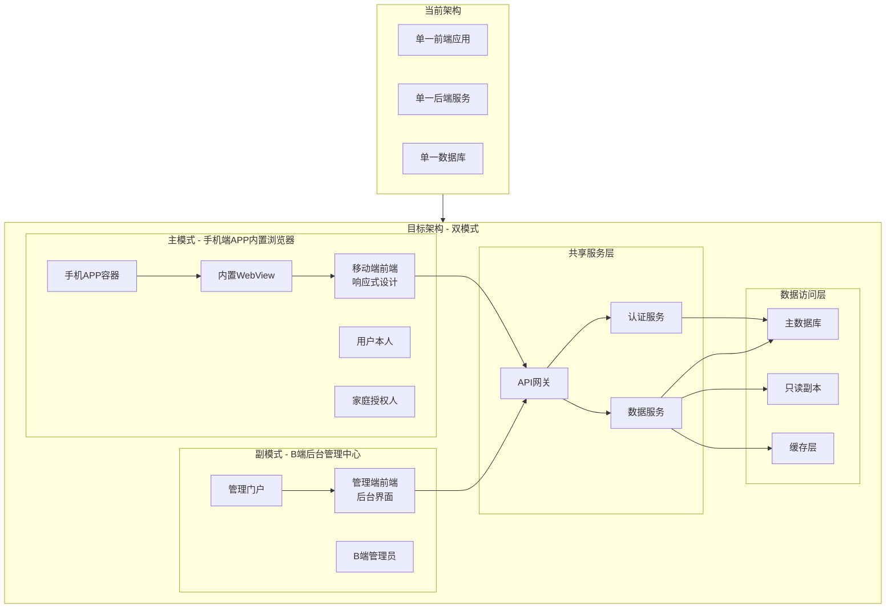
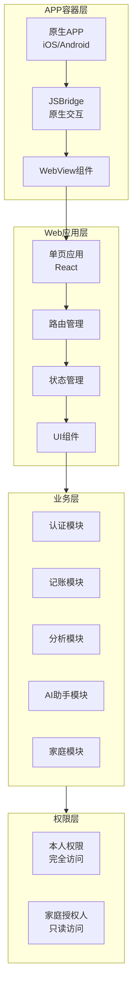
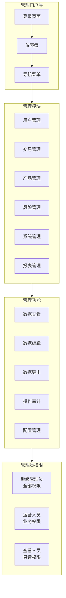
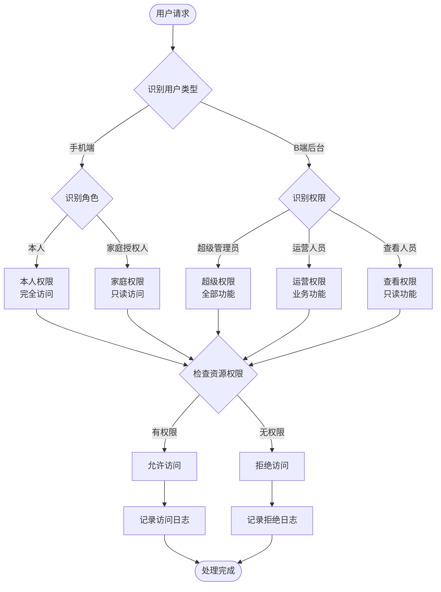
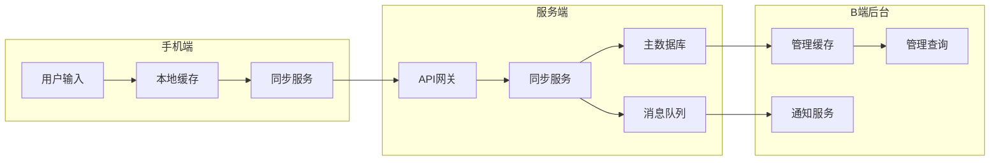
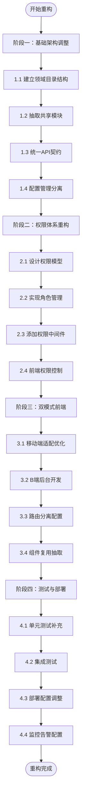
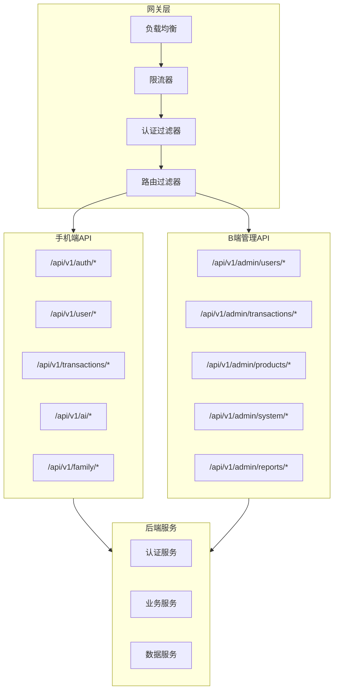

# 双模式架构重构方案

## 1. 双模式架构总览

```mermaid
flowchart TB
    subgraph Current["当前架构"]
        SingleFrontend["单一前端应用"]
        SingleBackend["单一后端服务"]
        SingleDB["单一数据库"]
    end

    subgraph Target["目标架构 - 双模式"]
        subgraph ModeA["主模式 - 手机端APP内置浏览器"]
            MobileApp["手机APP容器"]
            WebView["内置WebView"]
            MobileFrontend["移动端前端<br/>响应式设计"]
            MobileUser["用户本人"]
            FamilyUser["家庭授权人"]
        end

        subgraph ModeB["副模式 - B端后台管理中心"]
            AdminPortal["管理门户"]
            AdminFrontend["管理端前端<br/>后台界面"]
            AdminUser["B端管理员"]
        end

        subgraph SharedServices["共享服务层"]
            APIGateway["API网关"]
            AuthService["认证服务"]
            DataService["数据服务"]
        end

        subgraph DataAccess["数据访问层"]
            MainDB["主数据库"]
            ReadReplica["只读副本"]
            CacheLayer["缓存层"]
        end
    end

    Current --> Target
    MobileApp --> WebView --> MobileFrontend
    AdminPortal --> AdminFrontend
    
    MobileFrontend --> APIGateway
    AdminFrontend --> APIGateway
    
    APIGateway --> AuthService
    APIGateway --> DataService
    
    AuthService --> MainDB
    DataService --> MainDB
    DataService --> ReadReplica
    DataService --> CacheLayer
```

## 2. 手机端APP架构

```mermaid
flowchart TB
    subgraph AppContainer["APP容器层"]
        NativeApp["原生APP<br/>iOS/Android"]
        Bridge["JSBridge<br/>原生交互"]
        WebView_Layer["WebView组件"]
    end

    subgraph WebLayer["Web应用层"]
        SPA["单页应用<br/>React"]
        Router_Layer["路由管理"]
        StateMgmt["状态管理"]
        Components_Layer["UI组件"]
    end

    subgraph BusinessLayer["业务层"]
        Auth_Module["认证模块"]
        Accounting_Module["记账模块"]
        Analysis_Module["分析模块"]
        AI_Module["AI助手模块"]
        Family_Module["家庭模块"]
    end

    subgraph PermissionLayer["权限层"]
        Owner_Permission["本人权限<br/>完全访问"]
        Family_Permission["家庭授权人<br/>只读访问"]
    end

    NativeApp --> Bridge --> WebView_Layer
    WebView_Layer --> SPA
    SPA --> Router_Layer --> StateMgmt --> Components_Layer
    Components_Layer --> BusinessLayer
    BusinessLayer --> PermissionLayer
```

## 3. B端后台管理中心架构

```mermaid
flowchart TB
    subgraph AdminPortal_Layer["管理门户层"]
        Login_Page["登录页面"]
        Dashboard["仪表盘"]
        Navigation["导航菜单"]
    end

    subgraph AdminModules["管理模块"]
        UserMgmt["用户管理"]
        TransactionMgmt["交易管理"]
        ProductMgmt["产品管理"]
        RiskMgmt["风险管理"]
        SystemMgmt["系统管理"]
        ReportMgmt["报表管理"]
    end

    subgraph AdminFeatures["管理功能"]
        DataView["数据查看"]
        DataEdit["数据编辑"]
        DataExport["数据导出"]
        AuditTrail["操作审计"]
        ConfigManage["配置管理"]
    end

    subgraph AdminPermissions["管理员权限"]
        SuperAdmin["超级管理员<br/>全部权限"]
        Operator["运营人员<br/>业务权限"]
        Viewer["查看人员<br/>只读权限"]
    end

    Login_Page --> Dashboard --> Navigation
    Navigation --> AdminModules
    AdminModules --> AdminFeatures
    AdminFeatures --> AdminPermissions
```

## 4. 权限控制流程

```mermaid
flowchart TD
    Start([用户请求]) --> IdentifyUser{识别用户类型}
    
    IdentifyUser --> |手机端| MobileUser{识别角色}
    IdentifyUser --> |B端后台| AdminUser{识别权限}
    
    MobileUser --> |本人| OwnerAccess["本人权限<br/>完全访问"]
    MobileUser --> |家庭授权人| FamilyAccess["家庭权限<br/>只读访问"]
    
    AdminUser --> |超级管理员| SuperAccess["超级权限<br/>全部功能"]
    AdminUser --> |运营人员| OperatorAccess["运营权限<br/>业务功能"]
    AdminUser --> |查看人员| ViewerAccess["查看权限<br/>只读功能"]
    
    OwnerAccess --> CheckResource{检查资源权限}
    FamilyAccess --> CheckResource
    SuperAccess --> CheckResource
    OperatorAccess --> CheckResource
    ViewerAccess --> CheckResource
    
    CheckResource --> |有权限| AllowAccess[允许访问]
    CheckResource --> |无权限| DenyAccess[拒绝访问]
    
    AllowAccess --> LogAccess[记录访问日志]
    DenyAccess --> LogDeny[记录拒绝日志]
    
    LogAccess --> End([处理完成])
    LogDeny --> End
```

## 5. 手机端与B端数据同步

```mermaid
flowchart LR
    subgraph MobileSide["手机端"]
        MobileInput["用户输入"]
        MobileCache["本地缓存"]
        MobileSync["同步服务"]
    end

    subgraph ServerSide["服务端"]
        API_Gateway["API网关"]
        SyncService["同步服务"]
        MainDB_Layer["主数据库"]
        MessageQueue["消息队列"]
    end

    subgraph AdminSide["B端后台"]
        AdminQuery["管理查询"]
        AdminCache["管理缓存"]
        AdminNotify["通知服务"]
    end

    MobileInput --> MobileCache
    MobileCache --> MobileSync
    MobileSync --> API_Gateway
    
    API_Gateway --> SyncService
    SyncService --> MainDB_Layer
    SyncService --> MessageQueue
    
    MessageQueue --> AdminNotify
    MainDB_Layer --> AdminCache
    AdminCache --> AdminQuery
```

## 6. 重构实施路径

```mermaid
flowchart TD
    Start([开始重构]) --> Phase1["阶段一：基础架构调整"]
    
    Phase1 --> Task1_1["1.1 建立领域目录结构"]
    Task1_1 --> Task1_2["1.2 抽取共享模块"]
    Task1_2 --> Task1_3["1.3 统一API契约"]
    Task1_3 --> Task1_4["1.4 配置管理分离"]
    
    Task1_4 --> Phase2["阶段二：权限体系重构"]
    
    Phase2 --> Task2_1["2.1 设计权限模型"]
    Task2_1 --> Task2_2["2.2 实现角色管理"]
    Task2_2 --> Task2_3["2.3 添加权限中间件"]
    Task2_3 --> Task2_4["2.4 前端权限控制"]
    
    Task2_4 --> Phase3["阶段三：双模式前端"]
    
    Phase3 --> Task3_1["3.1 移动端适配优化"]
    Task3_1 --> Task3_2["3.2 B端后台开发"]
    Task3_2 --> Task3_3["3.3 路由分离配置"]
    Task3_3 --> Task3_4["3.4 组件复用抽取"]
    
    Task3_4 --> Phase4["阶段四：测试与部署"]
    
    Phase4 --> Task4_1["4.1 单元测试补充"]
    Task4_1 --> Task4_2["4.2 集成测试"]
    Task4_2 --> Task4_3["4.3 部署配置调整"]
    Task4_3 --> Task4_4["4.4 监控告警配置"]
    
    Task4_4 --> End([重构完成])
```

## 7. API网关设计

```mermaid
flowchart TB
    subgraph GatewayLayer["网关层"]
        LoadBalancer["负载均衡"]
        RateLimiter["限流器"]
        AuthFilter["认证过滤器"]
        RouterFilter["路由过滤器"]
    end

    subgraph MobileAPIs["手机端API"]
        Auth_API["/api/v1/auth/*"]
        User_API["/api/v1/user/*"]
        Transaction_API["/api/v1/transactions/*"]
        AI_API["/api/v1/ai/*"]
        Family_API["/api/v1/family/*"]
    end

    subgraph AdminAPIs["B端管理API"]
        Admin_User_API["/api/v1/admin/users/*"]
        Admin_Transaction_API["/api/v1/admin/transactions/*"]
        Admin_Product_API["/api/v1/admin/products/*"]
        Admin_System_API["/api/v1/admin/system/*"]
        Admin_Report_API["/api/v1/admin/reports/*"]
    end

    subgraph BackendServices["后端服务"]
        AuthService_Layer["认证服务"]
        BusinessService["业务服务"]
        DataService_Layer["数据服务"]
    end

    LoadBalancer --> RateLimiter --> AuthFilter --> RouterFilter
    
    RouterFilter --> MobileAPIs
    RouterFilter --> AdminAPIs
    
    MobileAPIs --> BackendServices
    AdminAPIs --> BackendServices
```

## 8. 部署架构演进

```mermaid
flowchart LR
    subgraph Current_Deploy["当前部署"]
        SingleServer["单服务器"]
        PM2_Process["PM2进程"]
        SQLite_DB["SQLite"]
    end

    subgraph Phase1_Deploy["阶段一部署"]
        AppServer["应用服务器"]
        DBServer["数据库服务器"]
        Nginx["Nginx反向代理"]
    end

    subgraph Phase2_Deploy["阶段二部署"]
        MultiApp["多应用实例"]
        LoadBalancer_Layer["负载均衡"]
        PostgreSQL["PostgreSQL"]
        Redis["Redis缓存"]
    end

    subgraph Target_Deploy["目标部署"]
        ContainerCluster["容器集群"]
        APIGateway_Layer["API网关"]
        MasterSlaveDB["主从数据库"]
        DistributedCache["分布式缓存"]
    end

    Current_Deploy --> Phase1_Deploy
    Phase1_Deploy --> Phase2_Deploy
    Phase2_Deploy --> Target_Deploy
```
