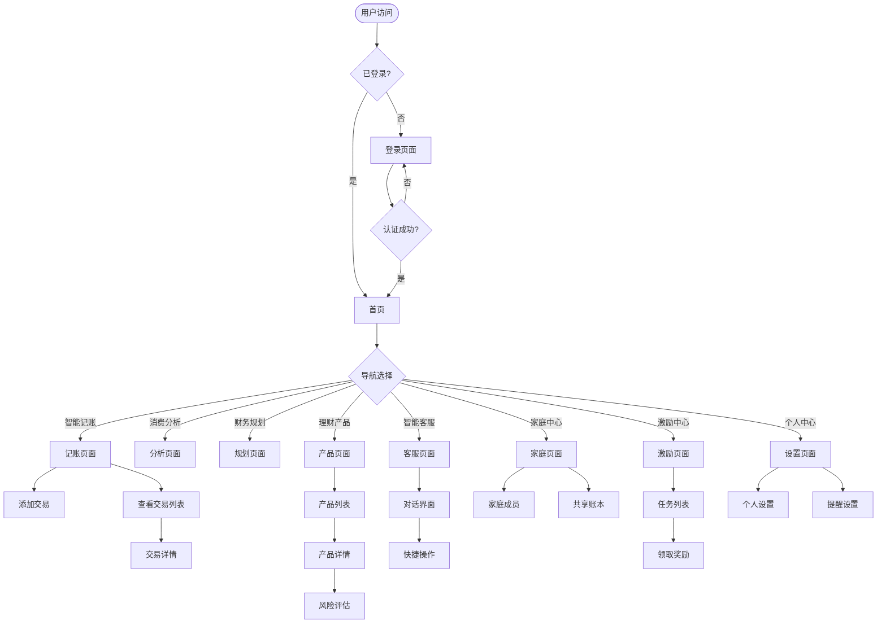
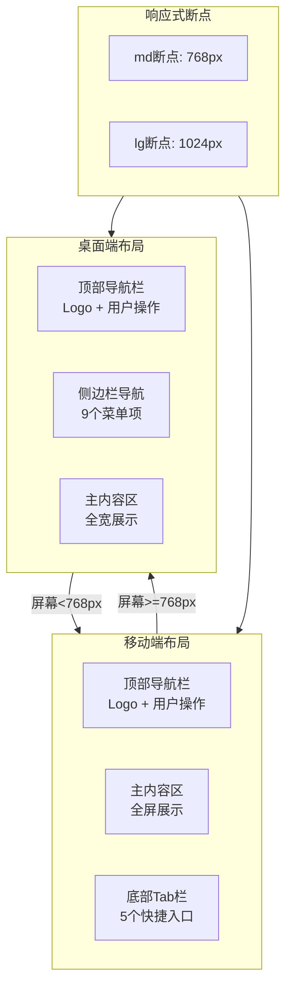
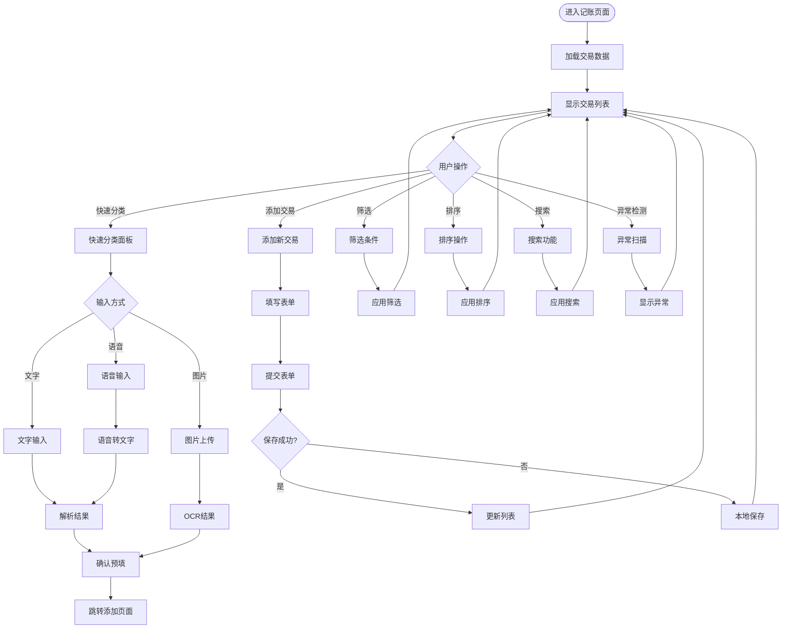
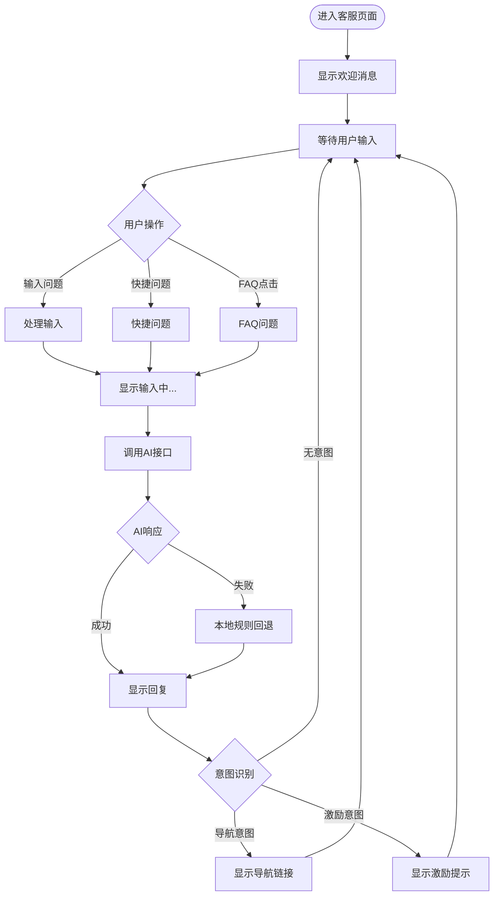
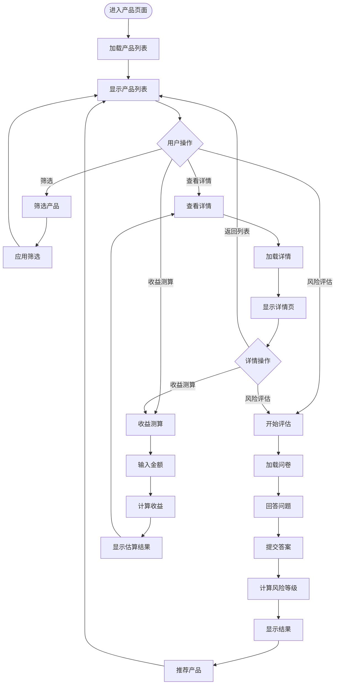
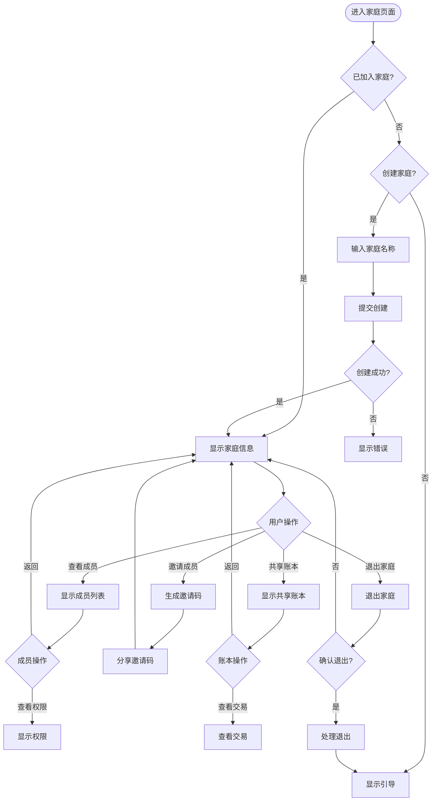
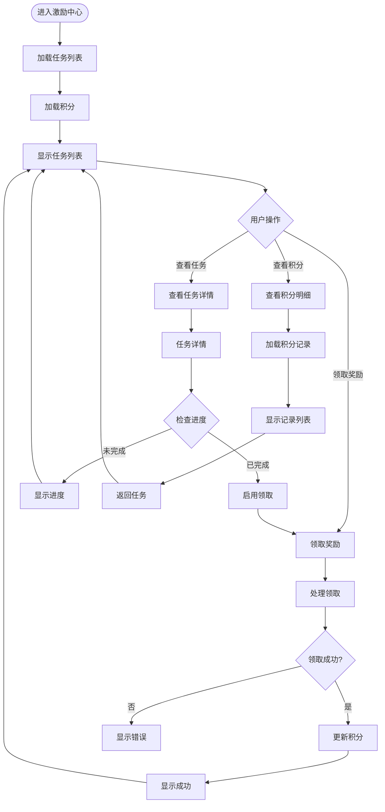
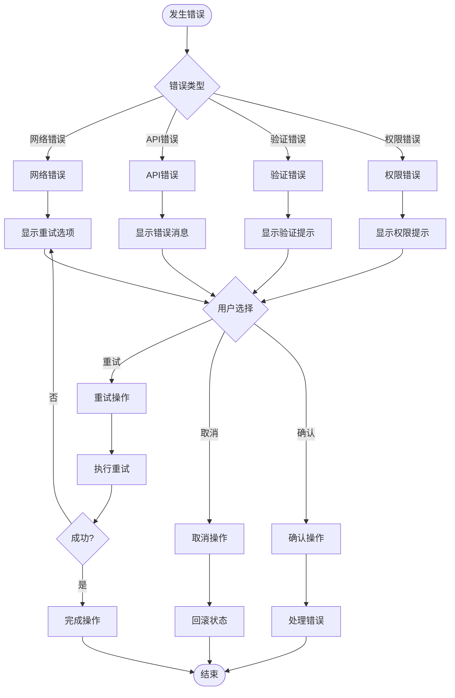

# 用户交互与界面设计流程图

## 1. 用户导航流程

```mermaid
flowchart TD
    Start([用户访问]) --> LoginCheck{已登录?}
    
    LoginCheck --> |否| LoginPage[登录页面]
    LoginCheck --> |是| HomePage[首页]
    
    LoginPage --> AuthSuccess{认证成功?}
    AuthSuccess --> |是| HomePage
    AuthSuccess --> |否| LoginPage
    
    HomePage --> NavChoice{导航选择}
    
    NavChoice --> |智能记账| AccountingPage[记账页面]
    NavChoice --> |消费分析| AnalysisPage[分析页面]
    NavChoice --> |财务规划| PlanningPage[规划页面]
    NavChoice --> |理财产品| ProductsPage[产品页面]
    NavChoice --> |智能客服| ServicePage[客服页面]
    NavChoice --> |家庭中心| FamilyPage[家庭页面]
    NavChoice --> |激励中心| IncentivePage[激励页面]
    NavChoice --> |个人中心| SettingsPage[设置页面]
    
    AccountingPage --> AddTransaction[添加交易]
    AccountingPage --> ViewTransactions[查看交易列表]
    ViewTransactions --> TransactionDetail[交易详情]
    
    ProductsPage --> ProductList[产品列表]
    ProductList --> ProductDetail[产品详情]
    ProductDetail --> RiskAssessment[风险评估]
    
    ServicePage --> ChatInterface[对话界面]
    ChatInterface --> QuickActions[快捷操作]
    
    FamilyPage --> FamilyMembers[家庭成员]
    FamilyPage --> SharedLedger[共享账本]
    
    IncentivePage --> TaskList[任务列表]
    TaskList --> ClaimReward[领取奖励]
    
    SettingsPage --> ProfileSettings[个人设置]
    SettingsPage --> ReminderSettings[提醒设置]
```

## 2. 页面布局响应式设计

```mermaid
flowchart TB
    subgraph Desktop["桌面端布局"]
        DesktopHeader["顶部导航栏<br/>Logo + 用户操作"]
        DesktopSidebar["侧边栏导航<br/>9个菜单项"]
        DesktopContent["主内容区<br/>全宽展示"]
    end

    subgraph Mobile["移动端布局"]
        MobileHeader["顶部导航栏<br/>Logo + 用户操作"]
        MobileContent["主内容区<br/>全屏展示"]
        MobileTabBar["底部Tab栏<br/>5个快捷入口"]
    end

    subgraph Responsive["响应式断点"]
        Breakpoint_MD["md断点: 768px"]
        Breakpoint_LG["lg断点: 1024px"]
    end

    Desktop --> |屏幕<768px| Mobile
    Mobile --> |屏幕>=768px| Desktop
    
    Responsive --> Desktop
    Responsive --> Mobile
```

## 3. 记账页面交互流程

```mermaid
flowchart TD
    Start([进入记账页面]) --> LoadData[加载交易数据]
    LoadData --> DisplayList[显示交易列表]
    
    DisplayList --> UserAction{用户操作}
    
    UserAction --> |快速分类| QuickClassify[快速分类面板]
    UserAction --> |添加交易| AddNew[添加新交易]
    UserAction --> |筛选| Filter[筛选条件]
    UserAction --> |排序| Sort[排序操作]
    UserAction --> |搜索| Search[搜索功能]
    UserAction --> |异常检测| AnomalyScan[异常扫描]
    
    QuickClassify --> InputMethod{输入方式}
    InputMethod --> |文字| TextInput[文字输入]
    InputMethod --> |图片| ImageInput[图片上传]
    InputMethod --> |语音| VoiceInput[语音输入]
    
    TextInput --> ParseResult[解析结果]
    ImageInput --> OCRResult[OCR结果]
    VoiceInput --> SpeechResult[语音转文字]
    
    ParseResult --> ConfirmPrefill[确认预填]
    OCRResult --> ConfirmPrefill
    SpeechResult --> ParseResult
    
    ConfirmPrefill --> GotoAdd[跳转添加页面]
    
    AddNew --> FillForm[填写表单]
    FillForm --> SubmitForm[提交表单]
    SubmitForm --> SaveSuccess{保存成功?}
    SaveSuccess --> |是| UpdateList[更新列表]
    SaveSuccess --> |否| LocalSave[本地保存]
    
    Filter --> ApplyFilter[应用筛选]
    Sort --> ApplySort[应用排序]
    Search --> ApplySearch[应用搜索]
    AnomalyScan --> ShowAnomalies[显示异常]
    
    ApplyFilter --> DisplayList
    ApplySort --> DisplayList
    ApplySearch --> DisplayList
    ShowAnomalies --> DisplayList
    UpdateList --> DisplayList
    LocalSave --> DisplayList
```

## 4. 智能客服交互流程

```mermaid
flowchart TD
    Start([进入客服页面]) --> ShowWelcome[显示欢迎消息]
    ShowWelcome --> WaitForInput[等待用户输入]
    
    WaitForInput --> UserAction{用户操作}
    
    UserAction --> |输入问题| ProcessInput[处理输入]
    UserAction --> |快捷问题| QuickQuestion[快捷问题]
    UserAction --> |FAQ点击| FAQQuestion[FAQ问题]
    
    ProcessInput --> ShowTyping[显示输入中...]
    QuickQuestion --> ShowTyping
    FAQQuestion --> ShowTyping
    
    ShowTyping --> CallAI[调用AI接口]
    CallAI --> AIResponse{AI响应}
    
    AIResponse --> |成功| DisplayResponse[显示回复]
    AIResponse --> |失败| LocalFallback[本地规则回退]
    
    DisplayResponse --> IntentCheck{意图识别}
    IntentCheck --> |导航意图| ShowNavLink[显示导航链接]
    IntentCheck --> |激励意图| ShowIncentive[显示激励提示]
    IntentCheck --> |无意图| WaitForInput
    
    ShowNavLink --> WaitForInput
    ShowIncentive --> WaitForInput
    LocalFallback --> DisplayResponse
```

## 5. 理财产品交互流程

```mermaid
flowchart TD
    Start([进入产品页面]) --> LoadProducts[加载产品列表]
    LoadProducts --> DisplayProducts[显示产品列表]
    
    DisplayProducts --> UserAction{用户操作}
    
    UserAction --> |筛选| FilterProducts[筛选产品]
    UserAction --> |查看详情| ViewDetail[查看详情]
    UserAction --> |风险评估| StartAssessment[开始评估]
    UserAction --> |收益测算| EstimateYield[收益测算]
    
    FilterProducts --> ApplyFilter[应用筛选]
    ApplyFilter --> DisplayProducts
    
    ViewDetail --> LoadDetail[加载详情]
    LoadDetail --> ShowDetail[显示详情页]
    ShowDetail --> DetailAction{详情操作}
    
    DetailAction --> |收益测算| EstimateYield
    DetailAction --> |风险评估| StartAssessment
    DetailAction --> |返回列表| DisplayProducts
    
    StartAssessment --> LoadQuestions[加载问卷]
    LoadQuestions --> AnswerQuestions[回答问题]
    AnswerQuestions --> SubmitAnswers[提交答案]
    SubmitAnswers --> CalculateRisk[计算风险等级]
    CalculateRisk --> ShowResult[显示结果]
    ShowResult --> RecommendProducts[推荐产品]
    RecommendProducts --> DisplayProducts
    
    EstimateYield --> InputAmount[输入金额]
    InputAmount --> CalculateReturn[计算收益]
    CalculateReturn --> ShowEstimate[显示估算结果]
    ShowEstimate --> ViewDetail
```

## 6. 家庭中心交互流程

```mermaid
flowchart TD
    Start([进入家庭页面]) --> CheckFamily{已加入家庭?}
    
    CheckFamily --> |否| CreateFamily{创建家庭?}
    CheckFamily --> |是| ShowFamilyInfo[显示家庭信息]
    
    CreateFamily --> |是| InputFamilyName[输入家庭名称]
    CreateFamily --> |否| ShowGuide[显示引导]
    
    InputFamilyName --> SubmitCreate[提交创建]
    SubmitCreate --> CreateSuccess{创建成功?}
    CreateSuccess --> |是| ShowFamilyInfo
    CreateSuccess --> |否| ShowError[显示错误]
    
    ShowFamilyInfo --> UserAction{用户操作}
    
    UserAction --> |查看成员| ShowMembers[显示成员列表]
    UserAction --> |邀请成员| GenerateInvite[生成邀请码]
    UserAction --> |共享账本| ShowLedger[显示共享账本]
    UserAction --> |退出家庭| ExitFamily[退出家庭]
    
    ShowMembers --> MemberAction{成员操作}
    MemberAction --> |查看权限| ShowPermission[显示权限]
    MemberAction --> |返回| ShowFamilyInfo
    
    GenerateInvite --> ShareInvite[分享邀请码]
    ShareInvite --> ShowFamilyInfo
    
    ShowLedger --> LedgerAction{账本操作}
    LedgerAction --> |查看交易| ViewTransactions[查看交易]
    LedgerAction --> |返回| ShowFamilyInfo
    
    ExitFamily --> ConfirmExit{确认退出?}
    ConfirmExit --> |是| ProcessExit[处理退出]
    ConfirmExit --> |否| ShowFamilyInfo
    ProcessExit --> ShowGuide
```

## 7. 激励中心交互流程

```mermaid
flowchart TD
    Start([进入激励中心]) --> LoadTasks[加载任务列表]
    LoadTasks --> LoadPoints[加载积分]
    LoadPoints --> DisplayTasks[显示任务列表]
    
    DisplayTasks --> UserAction{用户操作}
    
    UserAction --> |查看任务| ViewTask[查看任务详情]
    UserAction --> |领取奖励| ClaimReward[领取奖励]
    UserAction --> |查看积分| ViewPoints[查看积分明细]
    
    ViewTask --> TaskDetail[任务详情]
    TaskDetail --> CheckProgress{检查进度}
    CheckProgress --> |已完成| EnableClaim[启用领取]
    CheckProgress --> |未完成| ShowProgress[显示进度]
    
    EnableClaim --> ClaimReward
    ShowProgress --> DisplayTasks
    
    ClaimReward --> ProcessClaim[处理领取]
    ProcessClaim --> ClaimSuccess{领取成功?}
    ClaimSuccess --> |是| UpdatePoints[更新积分]
    ClaimSuccess --> |否| ShowError[显示错误]
    
    UpdatePoints --> ShowSuccess[显示成功]
    ShowSuccess --> DisplayTasks
    
    ViewPoints --> LoadPointLog[加载积分记录]
    LoadPointLog --> DisplayLog[显示记录列表]
    DisplayLog --> BackToTasks[返回任务]
    BackToTasks --> DisplayTasks
```

## 8. 错误处理与用户反馈

```mermaid
flowchart TD
    Start([发生错误]) --> ErrorType{错误类型}
    
    ErrorType --> |网络错误| NetworkError[网络错误]
    ErrorType --> |API错误| APIError[API错误]
    ErrorType --> |验证错误| ValidationError[验证错误]
    ErrorType --> |权限错误| PermissionError[权限错误]
    
    NetworkError --> ShowRetry[显示重试选项]
    APIError --> ShowMessage[显示错误消息]
    ValidationError --> ShowValidation[显示验证提示]
    PermissionError --> ShowPermission[显示权限提示]
    
    ShowRetry --> UserChoice{用户选择}
    ShowMessage --> UserChoice
    ShowValidation --> UserChoice
    ShowPermission --> UserChoice
    
    UserChoice --> |重试| RetryAction[重试操作]
    UserChoice --> |取消| CancelAction[取消操作]
    UserChoice --> |确认| ConfirmAction[确认操作]
    
    RetryAction --> ExecuteRetry[执行重试]
    CancelAction --> RollbackState[回滚状态]
    ConfirmAction --> HandleError[处理错误]
    
    ExecuteRetry --> Success{成功?}
    Success --> |是| CompleteAction[完成操作]
    Success --> |否| ShowRetry
    
    RollbackState --> End([结束])
    HandleError --> End
    CompleteAction --> End
```
