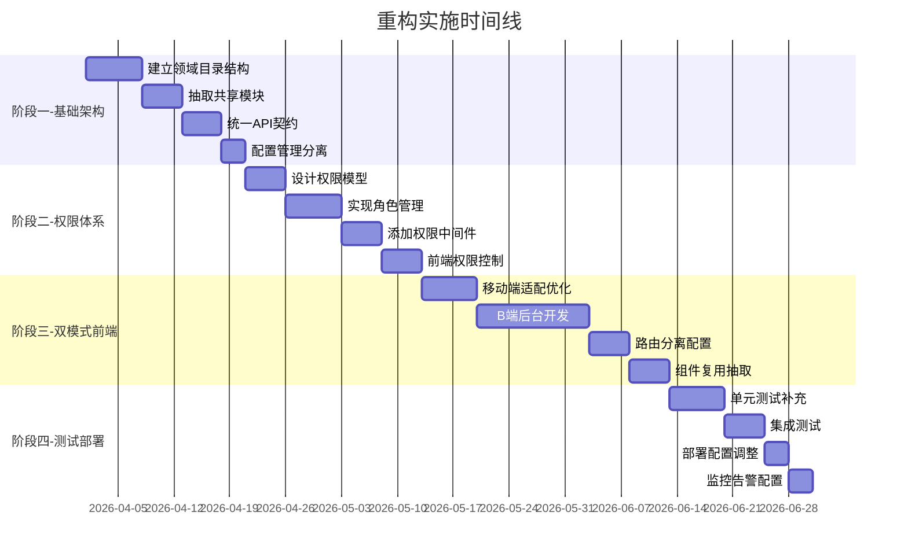
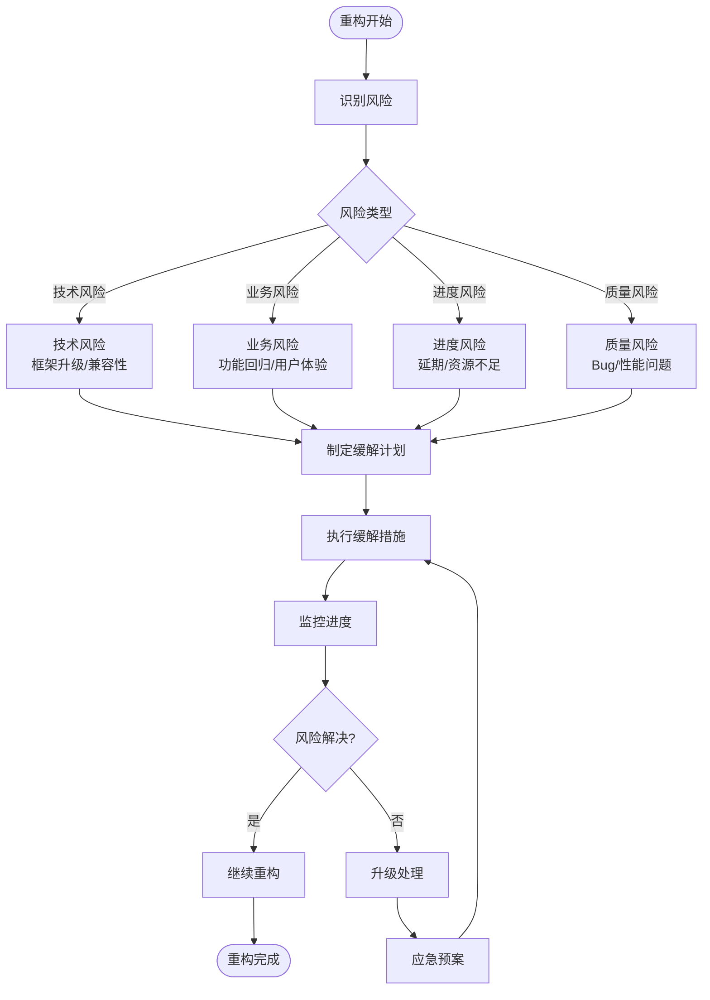
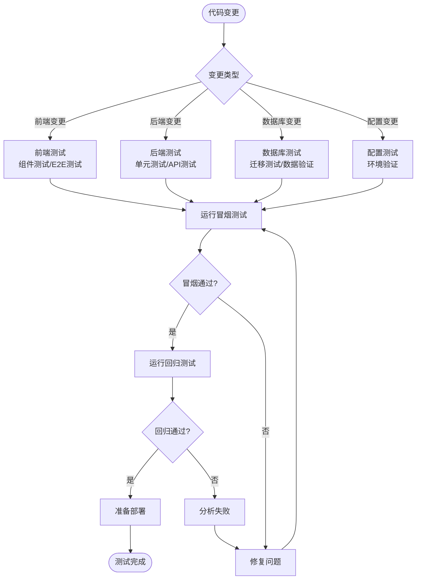
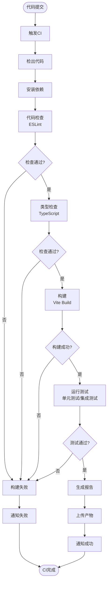
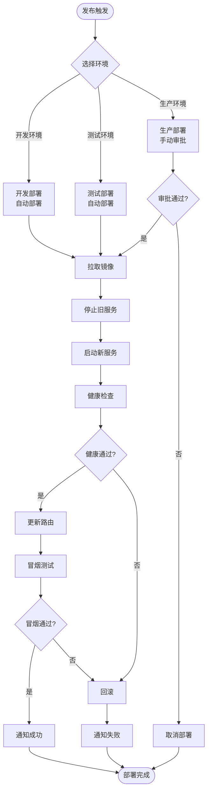
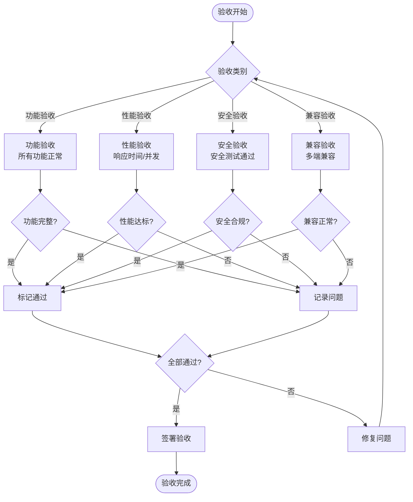

# 重构实施路径与任务分解

## 1. 重构总体路线图

```mermaid
gantt
    title 重构实施时间线
    dateFormat  YYYY-MM-DD
    section 阶段一-基础架构
    建立领域目录结构     :a1, 2026-04-01, 7d
    抽取共享模块         :a2, after a1, 5d
    统一API契约          :a3, after a2, 5d
    配置管理分离         :a4, after a3, 3d
    
    section 阶段二-权限体系
    设计权限模型         :b1, after a4, 5d
    实现角色管理         :b2, after b1, 7d
    添加权限中间件       :b3, after b2, 5d
    前端权限控制         :b4, after b3, 5d
    
    section 阶段三-双模式前端
    移动端适配优化       :c1, after b4, 7d
    B端后台开发          :c2, after c1, 14d
    路由分离配置         :c3, after c2, 5d
    组件复用抽取         :c4, after c3, 5d
    
    section 阶段四-测试部署
    单元测试补充         :d1, after c4, 7d
    集成测试             :d2, after d1, 5d
    部署配置调整         :d3, after d2, 3d
    监控告警配置         :d4, after d3, 3d
```

## 2. 阶段一任务分解

```mermaid
flowchart TD
    subgraph Phase1["阶段一：基础架构调整"]
        subgraph Task1_1["任务1.1：建立领域目录"]
            CreateDomainDir["创建领域目录"]
            MoveAuthFiles["移动认证相关文件"]
            MoveLedgerFiles["移动账本相关文件"]
            MoveAnalysisFiles["移动分析相关文件"]
            MoveAIFiles["移动AI相关文件"]
            MoveProductFiles["移动产品相关文件"]
        end

        subgraph Task1_2["任务1.2：抽取共享模块"]
            ExtractErrorModule["抽取错误处理模块"]
            ExtractAuditModule["抽取审计模块"]
            ExtractConfigModule["抽取配置模块"]
            ExtractTypesModule["抽取类型定义"]
        end

        subgraph Task1_3["任务1.3：统一API契约"]
            DefineSchema["定义Schema"]
            GenerateTypes["生成类型"]
            ValidateContract["契约测试"]
        end

        subgraph Task1_4["任务1.4：配置管理分离"]
            SeparateEnv["环境变量分离"]
            ConfigValidation["配置验证"]
            ConfigDocs["配置文档"]
        end
    end

    Task1_1 --> Task1_2 --> Task1_3 --> Task1_4
```

## 3. 阶段二任务分解

```mermaid
flowchart TD
    subgraph Phase2["阶段二：权限体系重构"]
        subgraph Task2_1["任务2.1：设计权限模型"]
            DefineRoles["定义角色"]
            DefinePermissions["定义权限"]
            DesignRBAC["设计RBAC模型"]
            DocumentModel["文档化模型"]
        end

        subgraph Task2_2["任务2.2：实现角色管理"]
            RoleEntity["角色实体"]
            UserRoleRelation["用户角色关系"]
            RoleCRUD["角色CRUD接口"]
            RoleMigration["数据迁移"]
        end

        subgraph Task2_3["任务2.3：添加权限中间件"]
            AuthMiddleware["认证中间件"]
            RoleMiddleware["角色中间件"]
            PermissionMiddleware["权限中间件"]
            ResourceMiddleware["资源中间件"]
        end

        subgraph Task2_4["任务2.4：前端权限控制"]
            RouteGuard["路由守卫"]
            PermissionDirective["权限指令"]
            PermissionComponent["权限组件"]
            PermissionUtils["权限工具函数"]
        end
    end

    Task2_1 --> Task2_2 --> Task2_3 --> Task2_4
```

## 4. 阶段三任务分解

```mermaid
flowchart TD
    subgraph Phase3["阶段三：双模式前端"]
        subgraph Task3_1["任务3.1：移动端适配优化"]
            ResponsiveLayout["响应式布局优化"]
            TouchInteraction["触摸交互优化"]
            PerformanceOpt["性能优化"]
            OfflineSupport["离线支持增强"]
        end

        subgraph Task3_2["任务3.2：B端后台开发"]
            AdminLayout["后台布局框架"]
            UserManagement["用户管理模块"]
            TransactionManagement["交易管理模块"]
            ProductManagement["产品管理模块"]
            SystemManagement["系统管理模块"]
            ReportManagement["报表管理模块"]
        end

        subgraph Task3_3["任务3.3：路由分离配置"]
            MobileRouter["移动端路由"]
            AdminRouter["管理端路由"]
            SharedRouter["共享路由"]
            RouterConfig["路由配置"]
        end

        subgraph Task3_4["任务3.4：组件复用抽取"]
            SharedComponents["共享组件库"]
            ComponentDocs["组件文档"]
            ComponentTests["组件测试"]
            ComponentStorybook["组件Storybook"]
        end
    end

    Task3_1 --> Task3_2 --> Task3_3 --> Task3_4
```

## 5. 阶段四任务分解

```mermaid
flowchart TD
    subgraph Phase4["阶段四：测试与部署"]
        subgraph Task4_1["任务4.1：单元测试补充"]
            ServiceTests["服务层测试"]
            ControllerTests["控制器测试"]
            HookTests["Hooks测试"]
            UtilTests["工具函数测试"]
        end

        subgraph Task4_2["任务4.2：集成测试"]
            APITests["API集成测试"]
            E2ETests["端到端测试"]
            PerformanceTests["性能测试"]
            SecurityTests["安全测试"]
        end

        subgraph Task4_3["任务4.3：部署配置调整"]
            DockerConfig["Docker配置"]
            CI_CD_Pipeline["CI/CD流水线"]
            EnvConfig["环境配置"]
            DeployScripts["部署脚本"]
        end

        subgraph Task4_4["任务4.4：监控告警配置"]
            LogCollection["日志收集"]
            MetricsCollection["指标收集"]
            AlertRules["告警规则"]
            Dashboard["监控面板"]
        end
    end

    Task4_1 --> Task4_2 --> Task4_3 --> Task4_4
```

## 6. 风险控制流程

```mermaid
flowchart TD
    Start([重构开始]) --> IdentifyRisks[识别风险]
    
    IdentifyRisks --> RiskType{风险类型}
    
    RiskType --> |技术风险| TechRisk["技术风险<br/>框架升级/兼容性"]
    RiskType --> |业务风险| BizRisk["业务风险<br/>功能回归/用户体验"]
    RiskType --> |进度风险| ScheduleRisk["进度风险<br/>延期/资源不足"]
    RiskType --> |质量风险| QualityRisk["质量风险<br/>Bug/性能问题"]
    
    TechRisk --> MitigationPlan[制定缓解计划]
    BizRisk --> MitigationPlan
    ScheduleRisk --> MitigationPlan
    QualityRisk --> MitigationPlan
    
    MitigationPlan --> ExecuteMitigation[执行缓解措施]
    ExecuteMitigation --> MonitorProgress[监控进度]
    
    MonitorProgress --> RiskResolved{风险解决?}
    RiskResolved --> |是| ContinueRefactor[继续重构]
    RiskResolved --> |否| EscalateRisk[升级处理]
    
    EscalateRisk --> EmergencyPlan[应急预案]
    EmergencyPlan --> ExecuteMitigation
    
    ContinueRefactor --> End([重构完成])
```

## 7. 回归测试策略

```mermaid
flowchart TD
    Start([代码变更]) --> ChangeType{变更类型}
    
    ChangeType --> |前端变更| FrontendTest["前端测试<br/>组件测试/E2E测试"]
    ChangeType --> |后端变更| BackendTest["后端测试<br/>单元测试/API测试"]
    ChangeType --> |数据库变更| DBTest["数据库测试<br/>迁移测试/数据验证"]
    ChangeType --> |配置变更| ConfigTest["配置测试<br/>环境验证"]
    
    FrontendTest --> RunSmoke["运行冒烟测试"]
    BackendTest --> RunSmoke
    DBTest --> RunSmoke
    ConfigTest --> RunSmoke
    
    RunSmoke --> SmokeResult{冒烟通过?}
    SmokeResult --> |是| RunRegression["运行回归测试"]
    SmokeResult --> |否| FixIssue[修复问题]
    
    FixIssue --> RunSmoke
    
    RunRegression --> RegressionResult{回归通过?}
    RegressionResult --> |是| DeployReady[准备部署]
    RegressionResult --> |否| AnalyzeFailure[分析失败]
    
    AnalyzeFailure --> FixIssue
    
    DeployReady --> End([测试完成])
```

## 8. 持续集成流程

```mermaid
flowchart TD
    Start([代码提交]) --> TriggerCI[触发CI]
    
    TriggerCI --> Checkout[检出代码]
    Checkout --> InstallDeps[安装依赖]
    InstallDeps --> LintCheck["代码检查<br/>ESLint"]
    
    LintCheck --> LintResult{检查通过?}
    LintResult --> |否| FailBuild[构建失败]
    LintResult --> |是| TypeCheck["类型检查<br/>TypeScript"]
    
    TypeCheck --> TypeResult{检查通过?}
    TypeResult --> |否| FailBuild
    TypeResult --> |是| Build["构建<br/>Vite Build"]
    
    Build --> BuildResult{构建成功?}
    BuildResult --> |否| FailBuild
    BuildResult --> |是| RunTests["运行测试<br/>单元测试/集成测试"]
    
    RunTests --> TestResult{测试通过?}
    TestResult --> |否| FailBuild
    TestResult --> |是| GenerateReport[生成报告]
    
    GenerateReport --> UploadArtifact[上传产物]
    UploadArtifact --> NotifySuccess[通知成功]
    
    FailBuild --> NotifyFailure[通知失败]
    
    NotifySuccess --> End([CI完成])
    NotifyFailure --> End
```

## 9. 部署发布流程

```mermaid
flowchart TD
    Start([发布触发]) --> SelectEnv{选择环境}
    
    SelectEnv --> |开发环境| DevDeploy["开发部署<br/>自动部署"]
    SelectEnv --> |测试环境| TestDeploy["测试部署<br/>自动部署"]
    SelectEnv --> |生产环境| ProdDeploy["生产部署<br/>手动审批"]
    
    DevDeploy --> PullImage[拉取镜像]
    TestDeploy --> PullImage
    ProdDeploy --> ApprovalCheck{审批通过?}
    
    ApprovalCheck --> |是| PullImage
    ApprovalCheck --> |否| CancelDeploy[取消部署]
    
    PullImage --> StopOld[停止旧服务]
    StopOld --> StartNew[启动新服务]
    StartNew --> HealthCheck[健康检查]
    
    HealthCheck --> HealthResult{健康通过?}
    HealthResult --> |是| UpdateRoute[更新路由]
    HealthResult --> |否| Rollback[回滚]
    
    UpdateRoute --> SmokeTest[冒烟测试]
    SmokeTest --> SmokeResult{冒烟通过?}
    
    SmokeResult --> |是| NotifySuccess[通知成功]
    SmokeResult --> |否| Rollback
    
    Rollback --> NotifyFailure[通知失败]
    
    NotifySuccess --> End([部署完成])
    NotifyFailure --> End
    CancelDeploy --> End
```

## 10. 重构验收标准

```mermaid
flowchart TD
    Start([验收开始]) --> CheckCategory{验收类别}
    
    CheckCategory --> |功能验收| FuncCheck["功能验收<br/>所有功能正常"]
    CheckCategory --> |性能验收| PerfCheck["性能验收<br/>响应时间/并发"]
    CheckCategory --> |安全验收| SecCheck["安全验收<br/>安全测试通过"]
    CheckCategory --> |兼容验收| CompatCheck["兼容验收<br/>多端兼容"]
    
    FuncCheck --> FuncResult{功能完整?}
    PerfCheck --> PerfResult{性能达标?}
    SecCheck --> SecResult{安全合规?}
    CompatCheck --> CompatResult{兼容正常?}
    
    FuncResult --> |是| MarkPass[标记通过]
    FuncResult --> |否| RecordIssue[记录问题]
    
    PerfResult --> |是| MarkPass
    PerfResult --> |否| RecordIssue
    
    SecResult --> |是| MarkPass
    SecResult --> |否| RecordIssue
    
    CompatResult --> |是| MarkPass
    CompatResult --> |否| RecordIssue
    
    MarkPass --> AllPassed{全部通过?}
    RecordIssue --> AllPassed
    
    AllPassed --> |是| SignOff[签署验收]
    AllPassed --> |否| FixIssues[修复问题]
    
    FixIssues --> CheckCategory
    SignOff --> End([验收完成])
```
