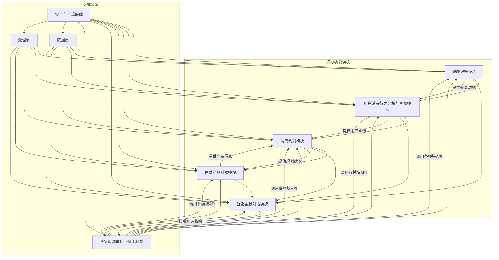
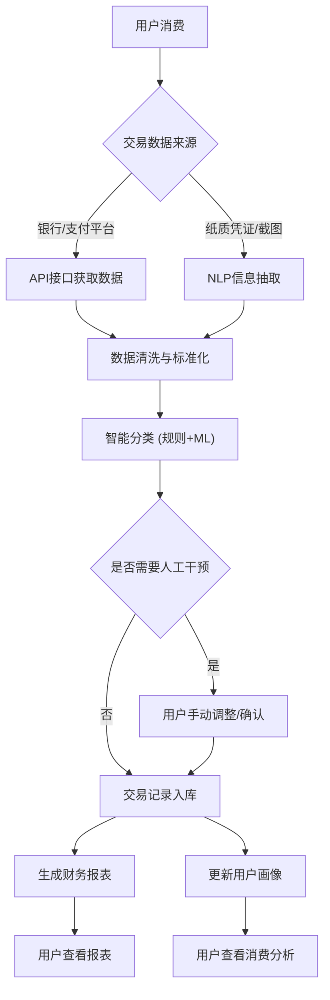
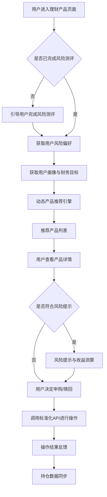
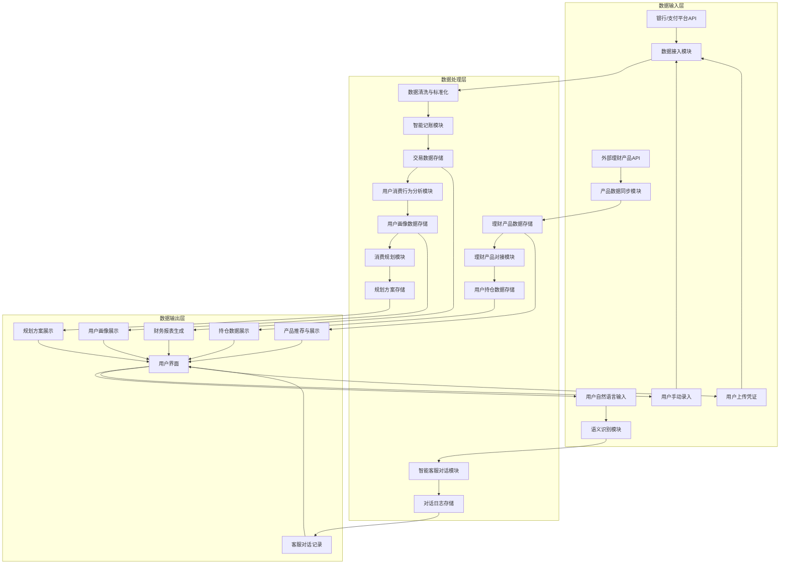

# 金智通金融智能体产品需求文档

[返回文档索引](索引.md) · [查看系统架构](architecture/架构-总览.md) · [查看后端接口](backend-api.md)

## 1. 产品概述

### 1.1 产品名称与定位

*   **产品名称:** 金智通
*   **产品定位:** 一款面向普通上班族、投资者、小微企业主的Web端综合金融智能体平台，通过智能记账、消费行为分析、个性化财务规划、智能客服对话和理财产品对接，提供全面、智能、个性化的金融服务支持。

### 1.2 产品应用语言

*   **产品应用语言:** 简体中文

### 1.3 产品愿景与目标

*   **产品愿景:** 成为用户信赖的智能金融管家，赋能用户实现财务自由与财富增长。
*   **产品目标:**
    *   实现金融数据的智能处理与分析，提升用户财务管理效率。
    *   提供个性化的消费规划与理财建议，帮助用户优化财务决策。
    *   构建高效的自然语言交互体验，提升用户服务满意度。
    *   确保系统安全性与合规性，保障用户数据与资金安全。
    *   支持高并发与低延迟的服务响应，提供流畅稳定的用户体验。

### 1.4 产品使用终端

*   **主要终端:** Web端桌面应用
*   **浏览器支持:** Chrome 90+、Firefox 88+、Safari 14+、Edge 90+
*   **分辨率支持:** 768x480及以上分辨率，最佳体验为1920x1080
*   **响应式适配:** 支持768px以上的所有桌面和平板设备。

### 1.5 核心价值主张

*   **智能化与自动化:** 自动分类交易、智能生成报表、个性化推荐，大幅减少用户手动操作。
*   **深度洞察:** 通过多维度分析，帮助用户清晰了解消费习惯、发现潜在风险与机遇。
*   **个性化定制:** 基于用户画像和财务目标，提供量身定制的财务规划和产品推荐。
*   **便捷交互:** 自然语言对话，简化操作流程，提升用户体验。
*   **安全合规:** 采用多重加密与区块链技术，确保数据安全与合规性。

### 1.6 目标用户群体分析

*   **普通上班族:**
    *   **特征:** 收入稳定，对个人财务管理有需求，但缺乏专业知识和时间。
    *   **痛点:** 记账繁琐、消费不透明、难以控制支出、缺乏理财渠道。
    *   **需求:** 自动化记账、消费分析、预算管理、基础理财建议。
*   **投资者:**
    *   **特征:** 对金融市场有一定了解，希望获取更专业的投资建议和产品信息。
    *   **痛点:** 信息过载、产品选择困难、风险评估复杂、缺乏个性化推荐。
    *   **需求:** 智能产品推荐、风险评估、收益测算、市场趋势分析。
*   **小微企业主:**
    *   **特征:** 关注企业现金流、税务规划、融资需求，同时也有个人财务规划需求。
    *   **痛点:** 企业与个人财务混淆、融资难、缺乏专业财务顾问。
    *   **需求:** 企业财务分析、融资建议、税务规划、个人与企业财务分离管理。

### 1.7 市场需求与竞品简析

*   **市场需求:**
    *   随着移动支付和互联网金融的普及，用户对个人财务管理工具的需求日益增长。
    *   传统记账工具功能单一，无法满足用户对深度分析和个性化建议的需求。
    *   金融产品日益复杂，用户需要专业的智能推荐和风险评估。
    *   智能客服和AI技术在金融领域的应用，提升了服务效率和用户体验。
*   **竞品简析:**
    *   **传统记账App (如随手记、挖财):** 功能集中于记账和基础报表，缺乏深度分析和智能推荐。
    *   **银行/券商App:** 提供部分理财功能，但通常不具备全面的个人财务分析和智能记账能力。
    *   **智能投顾平台:** 专注于投资推荐，缺乏全面的个人财务管理功能。
    *   **金智通优势:** 整合了智能记账、深度分析、个性化规划、智能客服和产品对接，形成一站式综合金融智能体，提供更全面、更智能的服务。

### 1.8 浏览器兼容性要求

*   **桌面浏览器:**
    *   Google Chrome (最新2个稳定版本)
    *   Mozilla Firefox (最新2个稳定版本)
    *   Microsoft Edge (最新2个稳定版本)
    *   Apple Safari (最新2个稳定版本)
*   **最低分辨率:** 1024x768px
*   **推荐分辨率:** 1920x1080px 及以上

## 2. 功能规格

### 2.1 功能详述

### 2.3 关键场景能力实施状态总览（聚焦四大主线）

| 场景 | 用户目标 | 关键能力拆解 | 当前状态 | 待完善 / 计划 | 预留 API / 后续对接点 |
|------|----------|--------------|-----------|----------------|------------------------|
| 日常记账 | 记录收支快速分类 | 1) 多图片上传 2) OCR 文字识别 3) 自动分类(规则/模型) 4) 手动录入 5) 异常标记 6) 图像/文字录入融合 7) 校对提醒 | 已实现：多图上传、OCR文本块接收、前端脱敏、分类结果占位；本地版“记账校对提醒”已实现（设置项+提醒卡片）；手动录入未做；异常标记未做 | 需：交易 CRUD、异常检测、提醒服务端化与留痕、规则+模型融合分类返回、批量分类与纠错反馈 | /api/v1/transactions (CRUD) /api/v1/accounting/classify(分类结果扩展) /api/v1/transactions/anomaly-scan /api/v1/reminders |
| 财务分析 | 理解消费习惯与画像 | 1) 频次/品类/趋势聚合 2) 标签画像生成 3) 图表可视化 4) 智能解读（自然语言总结） | 已实现：基础用户画像接口；“智能解读”占位版（静态卡片）；图表页面未实现；分析聚合接口缺失 | 需：消费聚合接口、图表组件、画像标签扩展>100、智能解读接入单模型 | /api/v1/consumption/summary /api/v1/user/profile/tags /api/v1/reports/consumption |
| 规划与建议 | 控制消费与目标达成 | 1) 规划方案 CRUD 2) 进度跟踪 3) 多方案对比 4) 智能客服解释与执行建议 | 已实现：进度查询接口；规划方案 CRUD 未实现；客服仅占位 | 需：规划 CRUD、建议生成、执行步骤存储、客服与规划联动意图 | /api/v1/plans (CRUD) /api/v1/plan/progress /api/v1/intent/recognize (扩展规划意图) |
| 理财决策 | 获得匹配的产品与风险提示 | 1) 产品列表/详情 2) 用户风险测评 3) 动态推荐 4) 收益/风险测算 5) 申购赎回 6) 持仓同步 | 已实现：列表+详情(含历史收益点)；风险测评/推荐/申购/持仓均未实现 | 需：风险测评流程、推荐引擎、收益测算接口、交易/持仓 API、合规提示输出 | /api/v1/products /api/v1/products/:id /api/v1/risk/assessment /api/v1/products/recommend /api/v1/products/:id/subscribe /api/v1/holdings |
| 智能客服（横向能力） | 跨场景自然语言访问与操作 | 1) 意图识别 2) 场景工具调用 3) 会话上下文 4) 结构化行动建议 | 已实现：意图识别接口；未与各场景 API 全集成；无多轮上下文管理 | 需：工具映射表、调用审计、上下文摘要、行动按钮结构 | /api/v1/intent/recognize /api/v1/audit/batch (计划) + 各业务接口作为工具 |

说明：当前策略是“先完成功能 API → 接入单模型试跑（DeepSeek/豆包等）→ 再构建 Coze 单 Agent 整合以上工具”。

#### 2.1.1 智能记账模块

| 功能ID | 功能名称 | 功能描述 | 优先级 |
|--------|---------|---------|--------|
| F-ACCOUNTING_001 | 交易自动分类 | 系统通过API接口获取银行流水、支付账单等结构化数据，并利用NLP技术抽取非结构化凭证信息。基于规则引擎（正则匹配+专家规则）与机器学习模型（XGBoost分类器）实现交易自动分类（餐饮、购物、投资等），准确率需达到90%以上。 | P0 |
| F-ACCOUNTING_002 | 多账户管理 | 支持用户添加和管理多个银行账户、信用卡账户、现金账户等，统一展示各账户余额和交易明细。 | P0 |
| F-ACCOUNTING_003 | 账单提醒 | 针对周期性账单（如信用卡还款日、水电费）提供自定义提醒功能，支持邮件、站内信等多种通知方式。 | P1 |
| F-ACCOUNTING_004 | 异常交易标记 | 系统自动识别并标记异常交易，如大额支出、非日常消费、异地交易等，提醒用户关注。 | P1 |
| F-ACCOUNTING_005 | 财务报表生成 | 自动生成标准化财务报表，包括收支明细表、资产负债表、现金流量表等，支持按时间、分类等维度进行筛选和查看。 | P0 |
| F-ACCOUNTING_006 | 手动记账录入 | 提供用户手动录入交易的功能，支持选择账户、分类、金额、日期、备注等信息。 | P0 |

#### 2.1.2 用户消费行为分析与画像模块

| 功能ID | 功能名称 | 功能描述 | 优先级 |
|--------|---------|---------|--------|
| F-ANALYSIS_001 | 消费频次分析 | 统计用户在不同消费品类、时间段、地点的消费频次，识别消费习惯。 | P0 |
| F-ANALYSIS_002 | 消费品类偏好 | 分析用户在各消费品类上的支出占比，识别主要消费偏好。 | P0 |
| F-ANALYSIS_003 | 消费金额趋势 | 展示用户在不同时间维度（日、周、月、年）的消费金额变化趋势。 | P0 |
| F-ANALYSIS_004 | 情感倾向分析 | 整合情感分析技术，解析用户对特定消费场景的情感倾向（如对某品牌的满意度）。 | P1 |
| F-ANALYSIS_005 | 用户标签体系构建 | 构建多维度用户标签体系，包括消费能力、风险偏好、生活方式等，形成动态更新的用户消费偏好图谱。 | P0 |
| F-ANALYSIS_006 | 用户画像输出 | 输出包含100+标签的用户画像，为个性化服务提供数据基础。 | P0 |

#### 2.1.3 消费规划模块

| 功能ID | 功能名称 | 功能描述 | 优先级 |
|--------|---------|---------|--------|
| F-PLANNING_001 | 个性化财务规划方案 | 根据用户画像、财务目标和市场数据，提供个性化的财务规划方案，包括预算管理、储蓄计划、债务管理等。 | P0 |
| F-PLANNING_002 | 信贷评估与风险分析 | 对用户的信贷资质进行评估，并分析潜在的信贷风险。 | P1 |
| F-PLANNING_003 | 信用评分生成 | 生成可解释的信用评分，帮助用户了解自身信用状况。 | P1 |
| F-PLANNING_004 | 储蓄计划推荐 | 根据用户的储蓄目标和风险偏好，推荐合适的储蓄计划。 | P0 |
| F-PLANNING_005 | 投资建议 | 联动投资策略agent，将财务目标转化为可执行的投资建议。 | P0 |
| F-PLANNING_006 | 规划模型优化 | 通过强化学习技术持续优化规划模型，提升方案的准确性和适应性。 | P1 |

#### 2.1.4 智能客服对话模块

| 功能ID | 功能名称 | 功能描述 | 优先级 |
|--------|---------|---------|--------|
| F-CS_001 | 上下文感知交互 | 基于NLP技术构建上下文感知交互系统，支持多轮对话与复杂指令理解。 | P0 |
| F-CS_002 | 监管法规知识库集成 | 集成2000+监管法规知识库，确保回答的合规性。 | P0 |
| F-CS_003 | 风控模型集成 | 集成300+风控模型，实现合规话术生成与风险自动提示。 | P0 |
| F-CS_004 | 合规话术生成 | "知识图谱+算法模型"实现合规话术生成，确保客服回复符合监管要求。 | P0 |
| F-CS_005 | 风险自动提示 | 根据用户提问和交互内容，自动提示潜在风险。 | P1 |
| F-CS_006 | 情感分析优化响应 | 根据情感分析结果优化响应策略，提升用户体验。 | P1 |
| F-CS_007 | CRM系统接口调用 | 调用CRM系统接口获取用户历史订单与服务记录，提供更精准的服务。 | P1 |
| F-CS_008 | Router Agent架构 | 采用Router Agent架构分发用户请求至处理节点，提高处理效率。 | P1 |

#### 2.1.5 理财产品对接模块

| 功能ID | 功能名称 | 功能描述 | 优先级 |
|--------|---------|---------|--------|
| F-PRODUCT_001 | 标准化API调用 | 通过标准化API调用外部金融产品服务，实现产品信息获取、申购、赎回等操作。 | P0 |
| F-PRODUCT_002 | 动态产品推荐引擎 | 构建动态产品推荐引擎，根据用户画像、风险偏好、投资目标等因素推荐合适的理财产品。 | P0 |
| F-PRODUCT_003 | 实时市场数据整合 | 整合Market Data Agent提供的实时市场数据与趋势指标，辅助产品分析。 | P0 |
| F-PRODUCT_004 | 风险提示与收益测算 | 提供理财产品的风险提示和收益测算功能，帮助用户全面了解产品特性。 | P0 |
| F-PRODUCT_005 | 产品信息更新 | 支持理财产品信息的自动更新，确保数据准确性。 | P1 |
| F-PRODUCT_006 | 申购流程自动化 | 实现理财产品申购流程的自动化，简化用户操作。 | P1 |
| F-PRODUCT_007 | 持仓数据同步 | 自动同步用户在外部平台的理财产品持仓数据，统一管理。 | P1 |
| F-PRODUCT_008 | 文档分析师模块调用 | 调用文档分析师模块处理产品说明书与监管文件，提取关键信息。 | P1 |

### 2.2 功能模块间的关系图

## 3. 用户流程

### 3.1 用户旅程地图

| 阶段 | 用户目标 | 行为 | 触点 | 痛点 | 机会点 | 金智通功能 |
|---|---|---|---|---|---|---|
| **感知与了解** | 了解产品价值 | 搜索、浏览、咨询 | 官网、广告、朋友推荐 | 信息碎片化、理解困难 | 清晰的产品介绍、智能客服引导 | 智能客服对话模块 |
| **注册与登录** | 成为用户 | 注册、登录 | 注册/登录页 | 注册流程繁琐、安全担忧 | 简化注册、多重认证 | 个人中心/设置页面 |
| **数据导入** | 导入财务数据 | 手动录入、银行/支付平台授权 | 智能记账页面 | 数据导入复杂、隐私顾虑 | 自动化导入、数据加密 | 智能记账模块 |
| **日常记账** | 记录收支 | 自动同步、手动录入 | 智能记账页面 | 忘记记账、分类不准 | 自动分类、智能提醒 | 智能记账模块 |
| **财务分析** | 了解消费习惯 | 查看报表、分析图表 | 消费分析页面 | 数据复杂、难以理解 | 可视化图表、智能解读 | 用户消费行为分析与画像模块 |
| **规划与建议** | 获取财务建议 | 查看规划方案、咨询客服 | 财务规划页面、智能客服页面 | 建议不个性化、执行困难 | 个性化方案、可执行步骤 | 消费规划模块、智能客服对话模块 |
| **理财决策** | 选择理财产品 | 浏览产品、查看详情、风险测评 | 理财产品页面 | 产品选择困难、风险不明 | 智能推荐、风险提示 | 理财产品对接模块 |
| **持续使用** | 管理财务、获取服务 | 日常操作、咨询客服 | 各功能页面 | 功能单一、响应慢 | 持续优化、高效服务 | 所有模块 |

### 3.2 关键业务流程图

#### 3.2.1 智能记账流程

#### 3.2.2 理财产品推荐流程

### 3.3 各场景下的用户操作步骤

#### 3.3.1 场景一：用户查看消费分析报告

1.  **用户操作:** 登录金智通平台。
2.  **系统反馈:** 进入首页/仪表盘（P-HOME）。
3.  **用户操作:** 点击左侧菜单“消费分析”或首页快捷入口。
4.  **系统反馈:** 跳转至消费分析页面（P-CONSUMPTION_ANALYSIS），展示消费趋势图表、品类偏好、频次分析等。
5.  **用户操作:** 选择时间范围（如“近三个月”）、筛选特定消费品类。
6.  **系统反馈:** 页面数据实时更新，图表和数据列表随之变化。
7.  **用户操作:** 点击“查看详细报告”按钮。
8.  **系统反馈:** 弹出详细报告模态弹窗，展示更深入的分析和建议。

#### 3.3.2 场景二：用户通过智能客服咨询理财问题

1.  **用户操作:** 登录金智通平台。
2.  **系统反馈:** 进入首页/仪表盘（P-HOME）。
3.  **用户操作:** 点击右下角“智能客服”图标或左侧菜单“智能客服”。
4.  **系统反馈:** 智能客服页面（P-CUSTOMER_SERVICE）或侧边抽屉式客服窗口弹出。
5.  **用户操作:** 在输入框中输入问题，例如：“我有10万元闲钱，该如何理财？”
6.  **系统反馈:** 智能客服进行语义识别，调用相关知识库和用户画像数据，生成并显示回答，同时可能推荐相关理财产品或引导至财务规划页面。
7.  **用户操作:** 继续追问或点击推荐链接。
8.  **系统反馈:** 智能客服进行多轮对话，或跳转至相应功能页面。

## 4. 数据流设计

### 4.1 数据结构与关系

*   **用户 (User):**
    *   用户ID (PK)
    *   用户名
    *   密码 (加密)
    *   邮箱/手机号
    *   注册时间
    *   风险偏好
    *   财务目标
    *   用户画像标签 (关联用户画像表)
*   **账户 (Account):**
    *   账户ID (PK)
    *   用户ID (FK)
    *   账户名称 (如：招商银行储蓄卡)
    *   账户类型 (储蓄卡、信用卡、现金等)
    *   余额
    *   关联银行/支付平台信息
*   **交易 (Transaction):**
    *   交易ID (PK)
    *   账户ID (FK)
    *   交易时间
    *   交易金额
    *   交易类型 (收入/支出)
    *   交易分类 (餐饮、购物、工资等)
    *   交易描述
    *   交易对方
    *   是否异常交易
    *   原始凭证数据 (如：银行流水截图URL)
*   **用户画像 (UserProfile):**
    *   画像ID (PK)
    *   用户ID (FK)
    *   标签名称 (如：高消费人群、风险厌恶型)
    *   标签值/权重
    *   更新时间
*   **财务规划 (FinancialPlan):**
    *   规划ID (PK)
    *   用户ID (FK)
    *   规划名称
    *   规划目标
    *   规划内容 (JSON/Text)
    *   生成时间
    *   状态 (进行中、已完成、已调整)
*   **理财产品 (FinancialProduct):**
    *   产品ID (PK)
    *   产品名称
    *   产品类型 (基金、保险、存款等)
    *   风险等级
    *   预期收益率
    *   起购金额
    *   产品说明书URL
    *   实时净值/价格
*   **用户持仓 (UserHolding):**
    *   持仓ID (PK)
    *   用户ID (FK)
    *   产品ID (FK)
    *   持仓数量
    *   持仓成本
    *   持仓市值
    *   购买时间
*   **客服对话 (ChatLog):**
    *   对话ID (PK)
    *   用户ID (FK)
    *   对话内容 (JSON/Text)
    *   对话时间
    *   意图识别结果
    *   调用模块/API记录

### 4.2 关键数据流向图

### 4.3 数据存储与处理原则

*   **数据安全:**
    *   所有敏感数据（如用户密码、银行账户信息）采用AES-256-GCM加密存储。
    *   数据传输强制使用TLS 1.3加密协议。
    *   采用FISCO BCOS区块链和Intel SGX技术，确保敏感数据的存储和计算安全。
    *   实施严格的访问控制和权限管理，遵循最小权限原则。
*   **数据隐私:**
    *   严格遵守GDPR、PCI DSS等相关数据隐私和合规要求。
    *   支持用户数据删除与修改（被遗忘权）。
    *   数据脱敏处理：在非生产环境和数据分析中，对敏感数据进行脱敏处理。
*   **数据一致性与可靠性:**
    *   采用事务机制确保数据操作的原子性、一致性、隔离性和持久性。
    *   定期进行数据备份（全量备份+增量备份），并实施灾备方案（RTO<4小时，RPO<15分钟）。
    *   分布式账本技术记录全链路调用，确保数据可追溯和不可篡改。
*   **数据处理:**
    *   采用流式处理和批处理相结合的方式，处理海量金融数据。
    *   利用机器学习和自然语言处理技术，实现数据的智能分析和理解。
    *   数据保留策略：用户行为与操作日志留存至少7年，满足合规要求。

## 5. 页面规格

### 5.1 页面概览

#### 5.1.1 整体布局架构

*   **布局模式:** Web端响应式布局 - 固定顶部导航栏 + 左侧菜单 + 主内容区。
*   **空间分配策略:**
    *   **顶部导航栏:** 建议高度60px，固定定位，包含Logo、主要导航链接、用户操作区。
    *   **左侧菜单:** 建议宽度200-240px（展开）/48-56px（折叠），可折叠，用于功能模块导航。
    *   **主内容区:** 核心展示区域，建议最小宽度720px，充分利用可用空间。
    *   **右侧面板:** **严格限制使用**，仅在屏幕宽度≥1440px且功能确实必要时使用，宽度280-320px。必须在布局中占据独立空间，绝对不能遮挡主内容区，且需确保主内容区宽度≥720px。
*   **导航体系:** 顶部主导航（用于模块切换）+ 左侧功能菜单（用于模块内功能导航）+ 面包屑导航（用于多层级页面）。
*   **交互模式:** 页面切换（通过导航菜单）、模态弹窗（用于表单编辑、确认操作）、侧边抽屉（用于详情查看、客服对话）、右键菜单（用于快捷操作）。

#### 5.1.2 页面列表

| 页面ID | 页面名称 | 核心功能 | 布局类型 | 右侧面板 |
|--------|---------|---------|---------|---------|
| P-LOGIN | 登录页 | 用户登录 | 单栏居中 | 不使用 |
| P-REGISTER | 注册页 | 用户注册 | 单栏居中 | 不使用 |
| P-HOME | 首页/仪表盘 | 账户总览、最近交易、消费趋势、待办提醒、快捷入口 | 二栏布局 | 慎用(仅在≥1440px且必要时) |
| P-ACCOUNTING | 智能记账页面 | 交易记录列表、添加交易、分类筛选、时间范围选择、搜索 | 二栏布局 | 不使用 |
| P-CONSUMPTION_ANALYSIS | 消费分析页面 | 消费趋势图表、品类偏好、频次分析、情感分析、用户画像 | 二栏布局 | 慎用(仅在≥1440px且必要时) |
| P-FINANCIAL_PLANNING | 财务规划页面 | 个性化规划方案、信贷评估、储蓄计划、投资建议 | 二栏布局 | 不使用 |
| P-FINANCIAL_PRODUCTS | 理财产品页面 | 产品列表、产品推荐、风险测评、产品详情、申购/赎回 | 二栏布局 | 不使用 |
| P-CUSTOMER_SERVICE | 智能客服页面 | 智能对话、问题解答、合规话术、风险提示 | 二栏布局 | 不使用 |
| P-USER_SETTINGS | 个人中心/设置页面 | 个人资料、账户管理、安全设置、通知偏好、风险测评 | 二栏布局 | 不使用 |
| P-TRANSACTION_DETAIL | 交易详情弹窗 | 交易详细信息展示、编辑、删除 | 模态弹窗 | 不适用 |
| P-ADD_TRANSACTION | 添加交易弹窗 | 手动录入交易信息 | 模态弹窗 | 不适用 |
| P-PRODUCT_DETAIL | 产品详情抽屉 | 理财产品详细信息、风险提示、收益测算 | 侧边抽屉 | 不适用 |
| P-RISK_ASSESSMENT | 风险测评弹窗 | 用户风险偏好测评问卷 | 模态弹窗 | 不适用 |

### 5.2 页面详情

#### 5.2.1 登录页（P-LOGIN）

**布局架构设计：**
- 页面类型：功能页面，用户身份验证入口。
- 布局模式：单栏居中布局，简洁明了。
- 空间分配：登录表单区域居中显示，背景为产品品牌元素或简洁背景。

**页面布局架构：**
- 顶部区域：产品Logo和名称。
- 主内容区域：登录表单，包含用户名/手机号输入框、密码输入框、登录按钮、忘记密码链接、注册链接。
- 底部区域：版权信息、隐私政策链接。

**响应式适配策略：**
- 大屏幕(≥1440px)：登录表单区域固定宽度（如400px），居中显示。
- 中屏幕(1200-1439px)：登录表单区域固定宽度，居中显示。
- 小屏幕(768-1199px)：登录表单区域宽度自适应，最大宽度限制，居中显示。
- 移动端(<768px)：登录表单区域宽度充满屏幕，上下边距保留。

**组件尺寸规范：**
- 按钮尺寸：登录按钮高度40px，宽度充满表单区域。
- 输入框：高度40px，宽度充满表单区域。
- 间距规范：输入框间距16px，按钮与输入框间距24px。

**核心功能：**
用户身份验证、密码找回入口、新用户注册入口。

#### 5.2.2 注册页（P-REGISTER）

**布局架构设计：**
- 页面类型：功能页面，新用户注册入口。
- 布局模式：单栏居中布局，与登录页风格一致。
- 空间分配：注册表单区域居中显示。

**页面布局架构：**
- 顶部区域：产品Logo和名称。
- 主内容区域：注册表单，包含用户名输入框、手机号/邮箱输入框、密码输入框、确认密码输入框、验证码输入框、获取验证码按钮、注册按钮、已有账号登录链接。
- 底部区域：版权信息、隐私政策链接。

**响应式适配策略：**
- 大屏幕(≥1440px)：注册表单区域固定宽度（如400px），居中显示。
- 中屏幕(1200-1439px)：注册表单区域固定宽度，居中显示。
- 小屏幕(768-1199px)：注册表单区域宽度自适应，最大宽度限制，居中显示。
- 移动端(<768px)：注册表单区域宽度充满屏幕，上下边距保留。

**组件尺寸规范：**
- 按钮尺寸：注册按钮高度40px，宽度充满表单区域。
- 输入框：高度40px，宽度充满表单区域。
- 间距规范：输入框间距16px，按钮与输入框间距24px。

**核心功能：**
新用户注册、获取验证码、用户协议确认。

#### 5.2.3 首页/仪表盘（P-HOME）

**布局架构设计：**
- 页面类型：概览页面，提供核心数据总览和功能入口。
- 布局模式：二栏布局，顶部导航+左侧菜单+主内容区。
- 空间分配：顶部导航固定，左侧菜单可折叠，主内容区动态填充。

**页面布局架构：**
- 顶部导航栏：Logo、主要导航链接（如首页、记账、分析、规划、产品、客服、设置）、搜索框、消息通知、用户头像 - 建议高度60px，固定定位。
- 左侧菜单：功能导航菜单，当前选中“首页”，支持折叠 - 建议宽度200-240px(展开)/48-56px(折叠)。
- 主内容区域：核心展示区域，建议最小宽度720px。
  - 页面头部：欢迎信息、面包屑导航（如“首页”）、主要操作按钮组（如“添加交易”） - 建议高度48-60px。
  - 账户总览区：卡片式展示总资产、总负债、净资产等关键指标。
  - 最近交易记录区：表格形式展示最近发生的交易明细。
  - 消费趋势图表区：折线图或柱状图展示月度/季度消费趋势。
  - 待办事项/提醒区：列表形式展示待处理的账单提醒、任务等。
  - 快捷功能入口区：图标或卡片形式提供常用功能的快速入口（如“智能记账”、“财务规划”）。
- 右侧面板：**慎用**：仅在屏幕宽度≥1440px且功能确实必要时使用，辅助功能区域，宽度280-320px。
  - 推荐内容：个性化理财产品推荐、热门文章推荐（**非关键信息**）。
  - 操作面板：快速添加交易、快速提问客服（**非核心功能**）。
  - 信息展示：市场热点、财经新闻摘要（**必须在主内容区有完整替代方案**）。

**响应式适配策略：**
- 大屏幕(≥1440px)：二栏布局，仅在功能确实必要时考虑三栏布局，如使用三栏，左侧200-240px + 主内容区(≥720px) + 右侧280-320px（**所有面板均占据布局空间，严禁遮挡**）。
- 中屏幕(1200-1439px)：二栏布局，**严禁使用右侧面板**，主内容区充满剩余空间。
- 小屏幕(768-1199px)：左侧菜单折叠或抽屉式，内容改为2列布局（**抽屉式菜单需用户主动触发**）。
- 移动端(<768px)：单栏布局，内容单列显示，保持核心功能（**所有侧边面板均隐藏或抽屉化**）。

**组件尺寸规范：**
- 按钮尺寸：主要操作按钮36px高度，次要按钮32px高度。
- 输入框：搜索框36px高度。
- 统计卡片：高度120-160px，宽度自适应。
- 表格行高：36-44px。
- 图标尺寸：导航图标20px，操作图标16px。
- 间距规范：卡片间距16px，区域间距20px，组件内间距12px。

**核心功能：**
账户资产总览、最近交易速览、消费趋势可视化、待办事项提醒、快捷功能入口。

**数据结构：**(最近交易记录)
| 列名 | 数据类型 | 宽度建议 | 是否可排序 | 操作功能 |
|------|---------|----------|----------|---------|
| 交易时间 | 日期时间 | 120px | 是 | 无 |
| 交易描述 | 文本 | 200px | 否 | 无 |
| 分类 | 标签 | 100px | 是 | 无 |
| 金额 | 数值 | 100px | 是 | 无 |
| 账户 | 文本 | 100px | 是 | 无 |
| 操作 | 操作按钮组 | 80px | 否 | 查看详情/编辑/删除 |

#### 5.2.4 智能记账页面（P-ACCOUNTING）

**布局架构设计：**
- 页面类型：列表管理页面，用于交易记录的查看、添加、编辑和筛选。
- 布局模式：二栏布局，顶部导航+左侧菜单+主内容区。
- 空间分配：顶部导航固定，左侧菜单可折叠，主内容区动态填充。

**页面布局架构：**
- 顶部导航栏：同首页。
- 左侧菜单：同首页，当前选中“智能记账”。
- 主内容区域：核心展示区域，建议最小宽度720px。
  - 页面头部：页面标题“智能记账”、面包屑导航、主要操作按钮组（如“添加新交易”） - 建议高度48-60px。
  - 工具栏区域：搜索框、交易分类筛选器、时间范围选择器、账户切换选项 - 建议高度40-48px。
  - 数据展示区域：交易记录列表（表格形式），支持多选、批量操作。
  - 分页区域：分页控件，显示总数、每页条数选择 - 建议高度40px。

**响应式适配策略：**
- 大屏幕(≥1440px)：二栏布局，主内容区充分利用空间。
- 中屏幕(1200-1439px)：二栏布局，主内容区充满剩余空间。
- 小屏幕(768-1199px)：左侧菜单折叠或抽屉式，表格列可隐藏或滚动。
- 移动端(<768px)：单栏布局，表格转换为卡片列表或可横向滚动。

**组件尺寸规范：**
- 按钮尺寸：添加新交易按钮高度36px。
- 输入框：搜索框36px高度，筛选器32px高度。
- 表格行高：36-44px。
- 间距规范：工具栏组件间距8-12px，区域间距16px。

**核心功能：**
交易记录列表展示、交易搜索与筛选、交易分类管理、时间范围查询、账户切换、添加新交易、交易详情查看、编辑与删除。

**数据结构：**(交易记录列表)
| 列名 | 数据类型 | 宽度建议 | 是否可排序 | 操作功能 |
|------|---------|----------|----------|---------|
| 复选框 | 布尔值 | 40px | 否 | 多选 |
| 交易时间 | 日期时间 | 120px | 是 | 无 |
| 交易描述 | 文本 | 200px | 否 | 无 |
| 分类 | 标签 | 100px | 是 | 无 |
| 金额 | 数值 | 100px | 是 | 无 |
| 账户 | 文本 | 100px | 是 | 无 |
| 备注 | 文本 | 150px | 否 | 无 |
| 操作 | 操作按钮组 | 120px | 否 | 查看详情/编辑/删除 |

#### 5.2.5 消费分析页面（P-CONSUMPTION_ANALYSIS）

**布局架构设计：**
- 页面类型：数据可视化与分析页面，展示用户消费行为和画像。
- 布局模式：二栏布局，顶部导航+左侧菜单+主内容区。
- 空间分配：顶部导航固定，左侧菜单可折叠，主内容区动态填充。

**页面布局架构：**
- 顶部导航栏：同首页。
- 左侧菜单：同首页，当前选中“消费分析”。
- 主内容区域：核心展示区域，建议最小宽度720px。
  - 页面头部：页面标题“消费分析”、面包屑导航、时间范围选择器 - 建议高度48-60px。
  - 消费趋势图表区：折线图或柱状图展示月度/季度/年度消费金额变化趋势。
  - 消费品类偏好区：饼图或柱状图展示各消费品类的支出占比。
  - 消费频次分析区：图表展示不同消费品类的消费频次。
  - 情感倾向分析区：文本或图表展示用户对特定消费场景的情感倾向。
  - 用户画像概览区：卡片或列表形式展示用户核心标签和画像摘要。
- 右侧面板：**慎用**：仅在屏幕宽度≥1440px且功能确实必要时使用，辅助功能区域，宽度280-320px。
  - 推荐内容：基于消费习惯推荐的省钱技巧、相关文章（**非关键信息**）。
  - 操作面板：快速生成详细报告、导出数据（**非核心功能**）。
  - 信息展示：消费洞察摘要、个性化建议（**必须在主内容区有完整替代方案**）。

**响应式适配策略：**
- 大屏幕(≥1440px)：二栏布局，仅在功能确实必要时考虑三栏布局，如使用三栏，左侧200-240px + 主内容区(≥720px) + 右侧280-320px（**所有面板均占据布局空间，严禁遮挡**）。
- 中屏幕(1200-1439px)：二栏布局，**严禁使用右侧面板**，主内容区充满剩余空间。
- 小屏幕(768-1199px)：左侧菜单折叠或抽屉式，图表可堆叠显示或提供切换视图。
- 移动端(<768px)：单栏布局，图表转换为可滚动或简化视图。

**组件尺寸规范：**
- 按钮尺寸：导出报告按钮高度32px。
- 图表区域：高度自适应，宽度充满可用空间。
- 间距规范：图表区域间距24px，组件间距12px。

**核心功能：**
消费趋势可视化、消费品类偏好分析、消费频次统计、情感倾向分析、用户画像概览。

#### 5.2.6 财务规划页面（P-FINANCIAL_PLANNING）

**布局架构设计：**
- 页面类型：功能页面，提供个性化财务规划方案和建议。
- 布局模式：二栏布局，顶部导航+左侧菜单+主内容区。
- 空间分配：顶部导航固定，左侧菜单可折叠，主内容区动态填充。

**页面布局架构：**
- 顶部导航栏：同首页。
- 左侧菜单：同首页，当前选中“财务规划”。
- 主内容区域：核心展示区域，建议最小宽度720px。
  - 页面头部：页面标题“财务规划”、面包屑导航、主要操作按钮组（如“创建新规划”） - 建议高度48-60px。
  - 规划方案列表区：表格或卡片形式展示用户已有的财务规划方案。
  - 规划详情区：点击方案后，在主内容区或侧边抽屉展示方案详情，包括目标、内容、执行步骤、进度等。
  - 信贷评估与风险分析区：展示用户的信用评分、信贷风险评估结果。
  - 储蓄计划推荐区：推荐的储蓄计划列表。
  - 投资建议区：推荐的投资建议列表。

**响应式适配策略：**
- 大屏幕(≥1440px)：二栏布局，主内容区充分利用空间。
- 中屏幕(1200-1439px)：二栏布局，主内容区充满剩余空间。
- 小屏幕(768-1199px)：左侧菜单折叠或抽屉式，规划方案列表可转换为卡片。
- 移动端(<768px)：单栏布局，规划方案列表单列显示。

**组件尺寸规范：**
- 按钮尺寸：创建新规划按钮高度36px。
- 规划方案卡片：高度自适应，宽度充满可用空间。
- 间距规范：区域间距24px，组件间距16px。

**核心功能：**
个性化财务规划方案管理、信贷评估、信用评分展示、储蓄计划推荐、投资建议展示。

**数据结构：**(规划方案列表)
| 列名 | 数据类型 | 宽度建议 | 是否可排序 | 操作功能 |
|------|---------|----------|----------|---------|
| 规划名称 | 文本 | 200px | 是 | 点击查看详情 |
| 目标 | 文本 | 150px | 否 | 无 |
| 状态 | 标签 | 100px | 是 | 无 |
| 生成日期 | 日期 | 120px | 是 | 无 |
| 操作 | 操作按钮组 | 120px | 否 | 编辑/删除/执行 |

#### 5.2.7 理财产品页面（P-FINANCIAL_PRODUCTS）

**布局架构设计：**
- 页面类型：列表与详情页面，展示和管理理财产品。
- 布局模式：二栏布局，顶部导航+左侧菜单+主内容区。
- 空间分配：顶部导航固定，左侧菜单可折叠，主内容区动态填充。

**页面布局架构：**
- 顶部导航栏：同首页。
- 左侧菜单：同首页，当前选中“理财产品”。
- 主内容区域：核心展示区域，建议最小宽度720px。
  - 页面头部：页面标题“理财产品”、面包屑导航、主要操作按钮组（如“风险测评”） - 建议高度48-60px。
  - 工具栏区域：产品类型筛选、风险等级筛选、预期收益筛选、搜索框 - 建议高度40-48px。
  - 数据展示区域：理财产品列表（卡片或表格形式），包含产品名称、类型、风险等级、预期收益、起购金额等。
  - 分页区域：分页控件，显示总数、每页条数选择 - 建议高度40px。

**响应式适配策略：**
- 大屏幕(≥1440px)：二栏布局，主内容区充分利用空间。
- 中屏幕(1200-1439px)：二栏布局，主内容区充满剩余空间。
- 小屏幕(768-1199px)：左侧菜单折叠或抽屉式，产品列表转换为单列卡片。
- 移动端(<768px)：单栏布局，产品列表单列显示。

**组件尺寸规范：**
- 按钮尺寸：风险测评按钮高度36px。
- 产品卡片：高度自适应，宽度充满可用空间。
- 间距规范：工具栏组件间距8-12px，产品卡片间距16px。

**核心功能：**
理财产品列表展示、产品筛选与搜索、产品详情查看、风险测评入口、产品推荐。

**数据结构：**(理财产品列表)
| 列名 | 数据类型 | 宽度建议 | 是否可排序 | 操作功能 |
|------|---------|----------|----------|---------|
| 产品名称 | 文本 | 200px | 是 | 点击查看详情 |
| 产品类型 | 标签 | 100px | 是 | 无 |
| 风险等级 | 标签 | 100px | 是 | 无 |
| 预期收益 | 数值 | 100px | 是 | 无 |
| 起购金额 | 数值 | 100px | 是 | 无 |
| 操作 | 操作按钮组 | 100px | 否 | 查看详情/申购 |

#### 5.2.8 智能客服页面（P-CUSTOMER_SERVICE）

**布局架构设计：**
- 页面类型：交互页面，提供智能客服对话功能。
- 布局模式：二栏布局，顶部导航+左侧菜单+主内容区。
- 空间分配：顶部导航固定，左侧菜单可折叠，主内容区动态填充。

**页面布局架构：**
- 顶部导航栏：同首页。
- 左侧菜单：同首页，当前选中“智能客服”。
- 主内容区域：核心展示区域，建议最小宽度720px。
  - 页面头部：页面标题“智能客服”、面包屑导航 - 建议高度48-60px。
  - 对话区域：聊天窗口，显示用户与智能客服的对话历史。
  - 输入区域：文本输入框、发送按钮、常用问题快捷入口。
  - 常见问题/热门话题区：侧边栏或底部区域，提供常见问题解答和热门话题链接。

**响应式适配策略：**
- 大屏幕(≥1440px)：二栏布局，主内容区充分利用空间。
- 中屏幕(1200-1439px)：二栏布局，主内容区充满剩余空间。
- 小屏幕(768-1199px)：左侧菜单折叠或抽屉式，对话区域自适应。
- 移动端(<768px)：单栏布局，对话区域充满屏幕。

**组件尺寸规范：**
- 按钮尺寸：发送按钮高度40px。
- 输入框：高度40px，宽度充满输入区域。
- 对话气泡：高度自适应。
- 间距规范：对话气泡间距8-12px，区域间距16px。

**核心功能：**
智能对话交互、上下文理解、多轮对话、常见问题解答、合规话术生成、风险提示。

#### 5.2.9 个人中心/设置页面（P-USER_SETTINGS）

**布局架构设计：**
- 页面类型：功能页面，管理用户个人信息和系统设置。
- 布局模式：二栏布局，顶部导航+左侧菜单+主内容区。
- 空间分配：顶部导航固定，左侧菜单可折叠，主内容区动态填充。

**页面布局架构：**
- 顶部导航栏：同首页。
- 左侧菜单：同首页，当前选中“个人中心”。
- 主内容区域：核心展示区域，建议最小宽度720px。
  - 页面头部：页面标题“个人中心”、面包屑导航 - 建议高度48-60px。
  - 左侧小型二级菜单：包含“基本资料”、“账户管理”、“安全设置”、“通知偏好”、“风险测评”等子项。
  - 右侧内容区：根据左侧二级菜单选择，显示对应设置表单或信息。
    - **基本资料:** 用户名、头像、联系方式等编辑表单。
    - **账户管理:** 已绑定银行/支付账户列表，添加/解绑账户入口。
    - **安全设置:** 修改密码、绑定手机/邮箱、登录日志等。
    - **通知偏好:** 账单提醒、系统通知等接收方式设置。
    - **风险测评:** 风险测评问卷入口及历史测评结果。

**响应式适配策略：**
- 大屏幕(≥1440px)：二栏布局，主内容区充分利用空间。
- 中屏幕(1200-1439px)：二栏布局，主内容区充满剩余空间。
- 小屏幕(768-1199px)：左侧菜单折叠或抽屉式，二级菜单可转换为顶部标签页或下拉菜单。
- 移动端(<768px)：单栏布局，二级菜单转换为列表或下拉菜单。

**组件尺寸规范：**
- 按钮尺寸：保存按钮高度36px。
- 输入框：高度36px。
- 间距规范：表单项间距16px，区域间距24px。

**核心功能：**
个人资料管理、账户绑定与管理、安全设置、通知偏好设置、风险测评。

#### 5.2.10 交易详情弹窗（P-TRANSACTION_DETAIL）

**布局架构设计：**
- 页面类型：详情展示页面，用于查看交易的详细信息。
- 布局模式：模态弹窗，覆盖在当前页面之上。
- 空间分配：弹窗内容居中显示，宽度固定。

**页面布局架构：**
- 弹窗头部：标题“交易详情”、关闭按钮。
- 弹窗内容区：
  - 交易基本信息：交易时间、交易描述、分类、金额、账户、备注。
  - 原始凭证：如银行流水截图、发票图片等。
  - 操作按钮：编辑、删除。

**响应式适配策略：**
- 大屏幕(≥1440px)：弹窗宽度固定（如600px），居中显示。
- 中屏幕(1200-1439px)：弹窗宽度固定，居中显示。
- 小屏幕(768-1199px)：弹窗宽度自适应，最大宽度限制，居中显示。
- 移动端(<768px)：弹窗全屏显示或底部滑出。

**组件尺寸规范：**
- 按钮尺寸：编辑/删除按钮高度32px。
- 文本信息：字体大小14-16px。
- 间距规范：信息项间距12px，按钮间距8px。

**核心功能：**
展示交易详细信息、提供编辑和删除交易的入口。

#### 5.2.11 添加交易弹窗（P-ADD_TRANSACTION）

**布局架构设计：**
- 页面类型：表单页面，用于手动录入或编辑交易信息。
- 布局模式：模态弹窗，覆盖在当前页面之上。
- 空间分配：弹窗内容居中显示，宽度固定。

**页面布局架构：**
- 弹窗头部：标题“添加新交易”或“编辑交易”、关闭按钮。
- 弹窗内容区：
  - 表单字段：交易日期、交易类型（收入/支出）、金额、账户、分类、交易描述、备注。
  - 操作按钮：保存、取消。

**响应式适配策略：**
- 大屏幕(≥1440px)：弹窗宽度固定（如500px），居中显示。
- 中屏幕(1200-1439px)：弹窗宽度固定，居中显示。
- 小屏幕(768-1199px)：弹窗宽度自适应，最大宽度限制，居中显示。
- 移动端(<768px)：弹窗全屏显示或底部滑出。

**组件尺寸规范：**
- 按钮尺寸：保存/取消按钮高度36px。
- 输入框：高度36px。
- 间距规范：表单项间距16px。

**核心功能：**
手动录入交易信息、编辑现有交易信息。

#### 5.2.12 产品详情抽屉（P-PRODUCT_DETAIL）

**布局架构设计：**
- 页面类型：详情展示页面，用于查看理财产品的详细信息。
- 布局模式：侧边抽屉，从页面右侧滑出。
- 空间分配：抽屉宽度固定，高度充满屏幕。

**页面布局架构：**
- 抽屉头部：标题“产品详情”、关闭按钮。
- 抽屉内容区：
  - 产品基本信息：产品名称、类型、风险等级、预期收益、起购金额、产品期限。
  - 产品介绍：详细的产品说明、投资策略、风险提示。
  - 收益测算：根据用户输入金额进行收益估算。
  - 操作按钮：申购、赎回（如已持仓）。

**响应式适配策略：**
- 大屏幕(≥1440px)：抽屉宽度固定（如400px），从右侧滑出。
- 中屏幕(1200-1439px)：抽屉宽度固定，从右侧滑出。
- 小屏幕(768-1199px)：抽屉宽度自适应，最大宽度限制，从右侧滑出。
- 移动端(<768px)：抽屉全屏显示或底部滑出。

**组件尺寸规范：**
- 按钮尺寸：申购/赎回按钮高度36px。
- 文本信息：字体大小14-16px。
- 间距规范：信息项间距12px，区域间距20px。

**核心功能：**
展示理财产品详细信息、风险提示、收益测算、提供申购/赎回入口。

#### 5.2.13 风险测评弹窗（P-RISK_ASSESSMENT）

**布局架构设计：**
- 页面类型：表单页面，用于用户进行风险偏好测评。
- 布局模式：模态弹窗，覆盖在当前页面之上。
- 空间分配：弹窗内容居中显示，宽度固定。

**页面布局架构：**
- 弹窗头部：标题“风险测评”、关闭按钮。
- 弹窗内容区：
  - 测评问卷：一系列选择题，涉及投资经验、风险承受能力、投资期限等。
  - 进度条：显示当前答题进度。
  - 操作按钮：上一题、下一题、提交。

**响应式适配策略：**
- 大屏幕(≥1440px)：弹窗宽度固定（如700px），居中显示。
- 中屏幕(1200-1439px)：弹窗宽度固定，居中显示。
- 小屏幕(768-1199px)：弹窗宽度自适应，最大宽度限制，居中显示。
- 移动端(<768px)：弹窗全屏显示或底部滑出。

**组件尺寸规范：**
- 按钮尺寸：提交按钮高度36px。
- 选项按钮：单选/多选框。
- 间距规范：问题间距20px，选项间距8px。

**核心功能：**
用户风险偏好测评问卷、生成风险测评结果。

## 6. 当前实现进度与差距分析（2025-11-10）

### 6.1 已接入与实现概览

| 模块 | 需求ID示例 | 状态 | 说明 |
|------|-----------|------|------|
| 智能记账上传与分类 | F-ACCOUNTING_001 | 部分完成 | 前端具备多图片上传、OCR文本脱敏与分类结果结构占位（后端分类接口仍为占位）。 |
| 多账户管理 | F-ACCOUNTING_002 | 未实现 | 需账户 CRUD、聚合余额 API。 |
| 财务报表生成 | F-ACCOUNTING_005 | 未实现 | 后端汇总与报表 API 待设计。 |
| 手动记账录入 | F-ACCOUNTING_006 | 未实现 | 需交易创建/编辑/删除 API 与前端弹窗。 |
| 消费分析核心图表 | F-ANALYSIS_001~003 | 未实现 | 前端页面骨架在规划中，需分析聚合 API。 |
| 用户画像标签获取 | F-ANALYSIS_005~006 | 部分完成 | `fetchUserProfile` 可返回标签与偏好，需扩展标签 >100 支持分页或分组。 |
| 财务规划进度 | F-PLANNING_001 | 部分完成 | `fetchPlanProgress` 已接入进度查询，规划方案 CRUD 未实现。 |
| 理财产品列表/详情 | F-PRODUCT_001,004 | 部分完成 | 列表与详情 API 包装存在；风险测评、申购/赎回、实时数据尚缺。 |
| 动态产品推荐 | F-PRODUCT_002 | 未实现 | 需结合画像与风险。 |
| 激励中心 | （扩展功能） | 基础完成 | 列表与领取 API 已有占位。 |
| 意图识别 | F-CS_001 (部分) | 基础完成 | `recognizeIntent` 封装；未与多模块路由联动全部场景。 |
| 智能客服多轮 | F-CS_001~005 | 未实现 | 需对接 Coze / 自建对话服务。 |
| 图片脱敏 | 隐私要求 | 多阶段完成 | 顶部区域像素化 + 旋转裁剪 + OCR定位 + 手动遮罩。 |
| 性能与分包 | 非功能性 | 进行中 | React vendor / Chart.js 拆分，按路由懒加载。 |

#### 6.1.1 聚焦关键能力状态（与你关注的功能一一对应）

| 关键能力 | 说明 | 当前状态 | 待完善/下一步 |
|----------|------|----------|----------------|
| 图像识别录入 | 前端多图上传+旋转/裁剪/脱敏，后端返回 OCR 文本与分类 | 前端完成上传与脱敏；OCR+分类接口为占位，分类结果未全量落地 | 扩展 classify 响应结构与准确率；落地异常提示/回退策略 |
| 文字识别录入 | 从文本描述录入一条交易 | 未实现 | 文本解析接口（意图+槽位提取）→ 交易创建 API |
| 用户消费行为分析与画像 | 频次/品类/趋势聚合 + 标签画像 | 基础画像接口已接；聚合与图表未实现 | 增加 /consumption/summary 与标签扩展接口；图表渲染与智能解读 |
| 可视化图表、智能解读 | 折线/柱状/饼图 + 模型自然语言总结 | 图表组件未接；智能解读未接 | 先出聚合 API + 图表，后接单模型生成解读文案 |
| 财务规划 | 方案 CRUD、进度、执行建议 | 仅进度查询已接 | 增加 /plans CRUD + 建议存储；进度联动首页卡片 |
| 智能客服（跨场景） | 意图路由、工具调用、结构化行动 | 仅意图识别封装；未集成各业务工具 | 列表化工具映射；返回 actions 按钮；接入单模型后验证 |
| 智能推荐 | 基于画像/目标的产品推荐 | 未实现 | /products/recommend 接口与特征抽取；前端推荐位 |
| 风险提示 | 对产品与操作给出风险提示 | 详情页展示基础风险指标 | 接入风险测评与产品风险因子解释；统一话术库 |

#### 6.1.2 本次变更与状态补充（2025-11-11）

* 规划页图标异常：已修复，统一替换为 Font Awesome 免费图标 fa-bullseye（影响范围：底部导航、侧栏、相关页面）。
* 记账校对提醒（“定期截图+校对分类”）：本地版已实现（设置页开关/频率/提醒时刻、本地持久化；首页提醒卡片支持“稍后/已校对”）。待办：服务端化（提醒创建/触发/完成审计、统一策略）。
* 快速分类：已实现（文本启发式；图片走 classify endpoint/FormData）。待办：多图批量、纠错反馈接口、置信度与差异比对。
* 分析页“智能解读”：占位版已实现（静态模式）。待办：先升级为单模型调用，后续再上 Agent 分步分析。
* 控支建议：已实现前端策略卡片与“应用/执行”逻辑，规划页与首页进度联动。待办：后端持久化与进度统一来源。
* 产品推荐：基础完成 + 画像感知（列表来源既有 products 接口，画像风险一键筛选，高风险产品对低/中风险用户有确认弹层）。待办：预算/期限多维推荐与排序、订阅/持仓占位、后端打分权重模型。

#### 6.1.3 运行状态与质量

* 开发：Vite 日志显示多次 ready，无报错堆栈但进程退出；疑似终端/任务面板中断，非代码错误。
* 构建：生产构建 PASS（tsc + vite build 均通过）。
* 测试与监控：尚未纳入（建议下一里程碑加入关键单测与性能基线）。

#### 6.1.4 隐私与脱敏

* 状态：已具备 OCR 像素化与本地处理流程。
* 待办：后端脱敏留痕、复核接口、最小必要字段缓存策略。

#### 6.1.5 关联改动（便于查阅）

* useAuditReminder.ts：提醒设置与到期判断。
* useUserAndProgress.ts：合并 localStorage 的 appliedPlans 与后端进度，按更新时间优先。
* 首页/产品：控支建议卡片、应用/执行、进度汇总；画像一键筛选与高风险确认弹层。
* 多处图标替换为 fa-bullseye。

#### 6.1.6 未完成清单（下一批优先级）

1) 后端化校对提醒与审计事件（替代本地提醒，形成留痕）。
2) 控支策略后端持久化（统一进度来源 + 多端一致）。
3) 产品推荐扩展（画像+预算+期限，排序权重与占位规划）。
4) 风险测评动态化（实时更新画像）。
5) 快速分类增强（批量、纠错反馈、置信度展示）。
6) 智能解读升级（单模型 → Agent）。
7) 测试与性能基线（关键路径单测、构建体积与首屏基线）。
8) 隐私与脱敏完善（日志留痕与复核）。
9) dev 退出监控（长驻/钩子）。
10) 更新需求文档标注完成度与路线图（本次已同步）。

#### 6.1.7 可视验证（建议）

* 启动开发环境（保持终端不被中断）。
* 验证页面：
    * 规划页：控支建议应用/记录、进度汇总。
    * 产品页：画像一键筛选、高风险弹层。
    * 首页：校对提醒卡片、规划进度同步展示。

### 6.2 已存在前端技术栈与架构

| 层级 | 方案 | 备注 |
|------|------|------|
| 构建 | Vite 7 + TS 5.8 | 手动 `manualChunks` 分离 vendor & chart。 |
| UI | React 19 + Tailwind 3.4 | 轻量响应式；需补充移动断点策略。 |
| 图表 | Chart.js 4（动态导入） | 产品详情历史收益曲线。 |
| 网络 | 自研 http 封装 | 重试、超时、统一 Audit。 |
| 审计 | `auditApi` / `auditError` | sendBeacon 退化，批量 flush。 |
| 隐私 | Canvas 脱敏管线 | 旋转→裁剪→OCR匹配→像素化→手动遮罩。 |
| 性能 | Lazy Route + Chunk Split | 后续可引入图片并发/优先级调度。 |

### 6.3 API 统一规范（建议补充）

1. 基础约定：所有业务响应使用 `{ code: number; message?: string; data: T }`。

2. 成功码：`code = 0`；常见错误码建议：
    * 1001 参数校验失败
    * 1002 未授权 / Token 失效
    * 1003 权限不足
    * 1004 资源不存在
    * 1005 业务规则冲突（如重复领取）
    * 2001 速率限制
    * 5000 内部错误

3. 鉴权：`Authorization: Bearer <JWT>`；刷新 Token 使用 `/api/v1/auth/refresh`。

4. 幂等：涉及资金/申购操作提供 `Idempotency-Key`。  
5. 分页：统一 `?page=1&size=20` 返回 `{ total, page, size, list: [] }`。  
6. 跟踪：后端通过响应头暴露 `X-Trace-Id` 与前端生成的 `traceId` 相关联。  
7. 速率限制提示：HTTP 429 + `Retry-After`。  
8. 国际化与数值：金额统一最小单位（分）或 decimal，带币种 `currency`。

### 6.4 已实现接口清单

| 接口 | 方法 | 路径 | 描述 |
|------|------|------|------|
| 用户画像获取 | GET | /api/v1/user/profile | 返回用户基本风险与标签。 |
| 规划进度 | GET | /api/v1/plan/progress | 按目标 ID 查询进度数组。 |
| 记账分类+OCR | POST | /api/v1/accounting/classify | 多图上传返回分类与 OCR 块。 |
| 理财产品列表 | GET | /api/v1/products | 条件筛选产品。 |
| 理财产品详情 | GET | /api/v1/products/:id | 单产品详情 + 历史收益点。 |
| 每日聚合流水 | GET | /api/v1/flows | 指定日期交易聚合。 |
| 意图识别 | POST | /api/v1/intent/recognize | 返回多意图候选。 |
| 激励列表 | GET | /api/v1/incentives | 可领取激励项。 |
| 领取激励 | POST | /api/v1/incentives/claim | 领取单个激励。 |

### 6.5 待补充接口建议

| 分类 | 接口建议 | 说明 |
|------|----------|------|
| 账户管理 | /api/v1/accounts (CRUD) | 多账户与余额聚合。 |
| 交易 CRUD | /api/v1/transactions (list/create/update/delete) | 支持手动记账、异常标记。 |
| 异常检测 | /api/v1/transactions/anomaly-scan | 批量返回异常交易建议。 |
| 报表 | /api/v1/reports/{type} | 收支、资产负债、现金流。 |
| 消费分析聚合 | /api/v1/consumption/summary | 品类占比、频次、趋势。 |
| 用户画像扩展 | /api/v1/user/profile/tags | 分组分页返回更多标签。 |
| 规划 CRUD | /api/v1/plans (CRUD) | 方案创建与进度更新。 |
| 风险测评 | /api/v1/risk/assessment (start/submit/result) | 问卷驱动得分。 |
| 产品推荐 | /api/v1/products/recommend | 基于画像与风险偏好。 |
| 产品申购赎回 | /api/v1/products/:id/subscribe | 资金操作，需幂等 & 权限。 |
| 持仓同步 | /api/v1/holdings (list/sync) | 外部平台对接。 |
| 客服对话 | /api/v1/chat (stream) | 与智能体消息往返 + 引用来源。 |
| 日志审计上报 | /api/v1/audit/batch | 前端批量审计入链或存储。 |

### 6.6 图片隐私与脱敏策略（前端管线）

流水图： 原始图片 -> 用户旋转 -> 用户裁剪 -> OCR 识别 -> 匹配敏感模式 -> 像素化绘制 -> 手动遮罩补充 -> 压缩上传。  
要点：

1. 旋转后再执行裁剪避免坐标错位。  
2. OCR bbox 与裁剪后画布建立归一化映射。  
3. 动态缩放像素化因子，兼顾性能与遮盖。  
4. 手动遮罩序列化（相对坐标），与后端二次校验。  
5. 失败回退：若 OCR 出错仍至少顶部 8% 像素化。  

### 6.7 前端性能策略与演进

| 策略 | 已实施 | 后续提升 |
|------|--------|----------|
| 路由懒加载 | 是 | 扩展至分析/规划模块。 |
| 手动 Chunk 拆分 | 是 | 分离 OCR/图像处理逻辑到 Worker。 |
| Canvas 操作 | 是 | 引入 OffscreenCanvas + Worker 并行。 |
| 审计批处理 | 是 | 加入前端压缩与差分。 |
| 按需图表加载 | 是 | 统一图表适配器组件。 |
| 图片并发控制 | 否 | 加入并发池+进度展示。 |
| 资源缓存策略 | 否 | 使用 Service Worker 预缓存。 |

### 6.8 移动与 Pad 适配优化建议

1. 断点：`<640` 超小；`640-1024` 平板；`>1024` 桌面。主目标锁定 `min-width: 360px`。  
2. 导航：左侧菜单在移动端抽屉式；顶部导航缩减为图标 + 汉堡按钮。  
3. 触控尺寸：交互元素最小高度 44px，遮罩/裁剪手柄 ~24px；可点击区域≥48px。  
4. 手势：图片双指缩放、双击复位、保留按钮旋转防误触。  
5. 上传流程：多图选择后生成低分辨率预览并并发处理队列 + 进度。  
6. 性能：超高分辨率先等比缩放到最大边 2000px 后再脱敏。  
7. 字体与对比度：正文 14-15px，标题 16-18px，满足 WCAG AA。  
8. 网络优化：HTTP/2；图片 JPEG 0.85；必要时分块断点续传。  
9. 骨架屏：列表、图表、客服消息使用 Skeleton + 渐进加载。  
10. 弱网兜底：超时 > 8s 提示离线与重试。  

### 6.9 Coze 平台单 Agent 对接方案

#### 6.9.1 功能映射

| Agent 能力 | 后端接口 | 描述 |
|------------|----------|------|
| 查询用户画像 | /api/v1/user/profile | 个性化回答。 |
| 查询规划进度 | /api/v1/plan/progress | 汇报完成度。 |
| 票据分类解析 | /api/v1/accounting/classify | 解读票据文本。 |
| 理财产品检索 | /api/v1/products | 回答收益与风险。 |
| 产品详情说明 | /api/v1/products/:id | 深度介绍。 |
| 意图校验 | /api/v1/intent/recognize | 二次确认指令。 |
| 激励操作 | /api/v1/incentives/claim | 奖励领取执行。 |

#### 6.9.2 对接步骤

1. 生成 OpenAPI 文档。  
2. 在 Coze 增加工具（Tool）与参数映射。  
3. 设计系统 Prompt：禁止泄露敏感数据 + 输出格式约束。  
4. 意图优先级策略与 fallback FAQ。  
5. 上下文窗口：最近对话 + 精简结果摘要。  
6. 返回前执行脱敏（卡号保留后四位）。  
7. 前端速率与后端限流组合。  
8. 审计记录：调用摘要批量上报。  
9. 输出结构：自然语言 + actions 数组。  

#### 6.9.3 安全与合规

| 风险点 | 缓解措施 |
|--------|----------|
| 越权调用 | 工具层 Scope 校验。 |
| 数据泄露 | 二次脱敏与长度限制。 |
| Prompt 注入 | 过滤敏感指令模式。 |
| 速率滥用 | 限流+退避。 |
| 不可追踪 | traceId 贯穿。 |

#### 6.9.4 前端集成

1. App WebView 单点登录携带 Token。  
2. 对话组件采用流式响应或 WebSocket。  
3. actions 转换为可点击按钮（导航/操作）。  
4. 引用来源展示提升可信度。  
5. 超时回退到静态 FAQ。  

### 6.10 后续迭代路线图

| 阶段 | 目标 | 关键任务 |
|------|------|----------|
| Phase 1 | 账户 & 交易基础 | 账户/交易 CRUD，异常检测。 |
| Phase 2 | 分析 & 报表 | 聚合与可视化组件。 |
| Phase 3 | 规划闭环 | 规划 CRUD + 风险测评。 |
| Phase 4 | 智能对话升级 | Coze Agent 工具完善。 |
| Phase 5 | 产品交易闭环 | 申购/赎回与持仓同步。 |
| Phase 6 | 安全合规强化 | 审计、幂等、限流、脱敏。 |
| Phase 7 | 移动体验与性能 | Worker、离线缓存、手势优化。 |

### 6.11 待确认开放问题

1. 网关与服务拆分策略。  
2. OCR 与分类是否合并返回。  
3. 产品实时数据刷新频率。  
4. 多语言需求是否进入路线图。  
5. SSO 协议（OAuth2 / 内部票据）。  
6. 审计是否上链及数据保留周期。  

### 6.12 行动项摘要

1. OpenAPI 初版输出。  
2. 账户 + 交易模型与 API 设计。  
3. 消费分析聚合接口。  
4. 规划与风险测评闭环。  
5. Coze Agent 工具与 Prompt 骨架。  
6. 图像处理迁移 Worker。  
7. 移动端手势与骨架屏实现。  
8. 审计批量上报实现。  

（本附加节为根据现状补充内容，需后端与合规团队进一步评审。）

### 6.13 实施顺序与集成策略（先完成功能，后接入 Agent）

#### 阶段 1：完成非 Agent 功能闭环

* 交易 CRUD、异常检测、提醒。
* 消费聚合与画像接口、图表渲染。
* 规划 CRUD 与进度联动首页。
* 产品推荐、风险测评、收益测算（查询+解释）。

#### 阶段 2：预留 API 并输出 OpenAPI

* 整理全部接口生成 OpenAPI 3.0 文档。
* 明确鉴权、分页、错误码、幂等等统一规范。
* 标注各接口“Agent 可用安全字段”。

#### 阶段 3：接入单模型（MVP 验证）

* 选择 DeepSeek / 豆包等中文模型。
* 前端新增“智能解读/客服”入口，仅调用后端 API + 单模型。
* 约束返回：自然语言 + actions（示例：{ type:'NAVIGATE', target:'/products?risk=LOW' }）。

#### 阶段 4：构建 Coze 单 Agent

* 将 API 注册为工具（或导入 OpenAPI 自动生成）。
* System Prompt 规范隐私、合规、动作格式、重试策略。
* actions → 前端路由 / API 调用；审计落地 /api/v1/audit/batch。

#### 阶段 5：目标体验达成

* 图片/文字录入 → 即时分类反馈。
* 分析查询 → 复用已计算聚合与画像（不重复重算）。
* 控制支出 → 给出多方案，可选后写入规划并展示在首页/规划页。
* 产品探索 → 综合画像与约束筛选产品并提示风险与注意事项。

